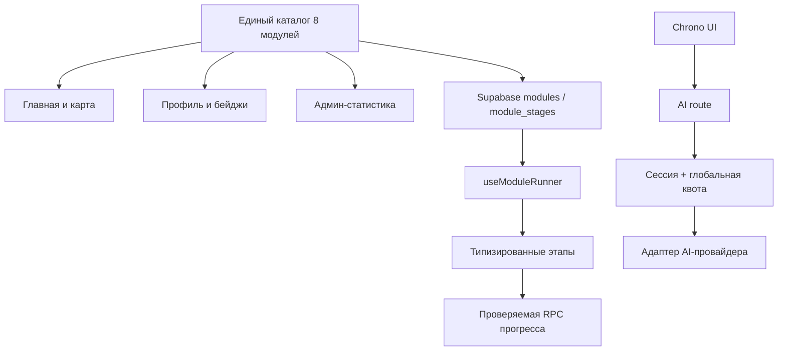

# Анализ проекта InfoQuest

**Дата аудита:** 9 августа 2026 года

**Повторная проверка:** 10 августа 2026 года
**Область проверки:** весь текущий репозиторий, пользовательские маршруты, первый учебный модуль, профиль, админ-панель, Supabase, Google OAuth, AI-помощник Chrono, локализация, доступность, видео и документация.

> Это технический и продуктовый аудит текущей версии. Он не заменяет юридическую проверку политики конфиденциальности и условий использования.

## 0. Статус повторной проверки

Обозначения: **исправлено** — подтверждено кодом, тестом или live-схемой; **частично** — основная защита работает, но остаётся проверяемая часть; **не исправлено** — замечание всё ещё воспроизводится; **внешняя проверка** — состояние нельзя доказать репозиторием.

| Пункт | Статус на 10 августа 2026 года | Подтверждение и остаток |
|---|---|---|
| P0.1 Google OAuth secret | Внешняя проверка | Секрет отсутствует в отслеживаемых файлах, но удаление старого secret и работу нового нужно подтвердить в Google Cloud и Supabase |
| P0.2 RO-финал | Исправлено в коде | RU/RO используют единый типизированный контракт; полного браузерного прохождения всех фаз RO в CI пока нет |
| P0.3 Privacy и AI consent | Частично | Реальный поток текста/аудио, согласие, несовершеннолетние и IP-отпечаток описаны; юридическое заключение и приватный контакт ещё нужны |
| P0.4 AI-доступ и расходы | Частично | Сессия, роли, Supabase-квоты, общий запросный бюджет, конкурентный lock и timeout работают; денежный hard cap BotHub не подтверждён |
| P1.1 Каталог 8 модулей | Исправлено | Один каталог используется главной, профилем, админкой и live Supabase: 8 модулей × 8 этапов, максимум 800 XP |
| P1.2 Защита прогресса | Частично | Прямые записи закрыты, порядок проверяет RPC; часть игровых score всё ещё формируется клиентом |
| P1.3 Реальный прогресс на главной | Частично | XP, щит и бейджи читаются из Supabase; центральная иллюстрация больше не затемняется при 0 XP, прогресс меняет только свечение; основной CTA и для вошедшего пользователя всё ещё ведёт на `/login` |
| P1.4 Последовательное открытие этапов | Исправлено | Ограничение действует в UI и RPC Supabase |
| P1.5 Клавиатура и таймеры | Исправлено в коде | Интерактивные цели стали `button`, добавлены focus-ring, `aria-pressed`, `aria-live`, перевод фокуса и пауза двух таймеров; нужен ручной screen-reader тест |
| P1.6 Субтитры | Не исправлено | У видео нет WebVTT `<track kind="captions">` и синхронных субтитров |
| P1.7 Локализация | Частично | `<html lang>` исправлен для RU/RO и RO-контракт финала унифицирован; переводы всё ещё распределены по файлам, `messages/*.json` пусты, остаются `Intro`, `Language`, `Close`, `HP` |
| P1.8 AI multipart | Частично | Есть лимит файла 4 МиБ, MIME allowlist и timeout; нет проверки Content-Length, сигнатуры, длительности и лимита расшифровки |
| P1.9 Quality gate | Частично | Локально lint, TypeScript, 32 unit/contract-теста и build проходят; 3 публичных Playwright smoke-теста найдены. Последний GitHub Actions красный из-за рассинхронизации lock-файла при `npm ci`; авторизованные E2E требуют `E2E_AUTH_STATE_B64` |
| Роли и блокировки | Частично | Пять ролей и email/account-блокировка работают; IP-блокировка закрывает локализованные страницы и запись прогресса, но `/api/ai` не входит в matcher proxy и требует отдельной IP-проверки |
| Архитектура модуля | Исправлено 10 августа | Координатор сокращён до 185 строк; этапы разделены, а последовательность, XP и RPC вынесены в общий типизированный `useModuleRunner` |
| Архитектура AI | Исправлено 10 августа | Route отвечает за auth/consent/quota/timeout, OpenAI-совместимые endpoints и модели изолированы интерфейсом `AiProvider` |
| Supabase types/env | Исправлено 10 августа 2026 | Клиенты типизированы общей схемой `Database`; production fallback удалён, обязательные env проходят единую fail-fast проверку |
| Route boundaries/заглушки | Исправлено 10 августа 2026 | Семь пустых маршрутов получили локализованные экраны; добавлены RU/RO `loading.tsx`, `error.tsx` с повтором запроса и полноценный `not-found.tsx` |
| Медиа | Частично исправлено 10 августа 2026 | MP4 уменьшены с 79,61 до 20,67 МиБ и защищены media budget; субтитры отложены по решению команды |
| UX и доступность P2 | Исправлено в коде 10 августа 2026 | Dialog, скрытая кнопка, typewriter, AI-status, пороги риска, Boss HP, слайдер, footer и локализованный QR исправлены; остаются ручное тестирование и продуктовый выбор гостевого режима |
| Незавершённые/устаревшие части | Исправлено 10 августа 2026 | Пустые заготовки удалены, README и scope актуализированы, старый аудит архивирован ссылкой, добавлены sitemap, robots, OpenGraph, canonical и hreflang |
| Definition of Done пилота | Подготовлено 10 августа 2026 | Зафиксированы 8 обязательных release gates, доказательства, stop-условия и форма GO/NO-GO; текущий статус — NO-GO до закрытия внешних и технических блокеров |
| Полное описание приложения | Подготовлено 12 августа 2026 | `docs/application-overview.md` описывает продукт, пользователей, маршруты, первый модуль, роли, AI, Supabase, архитектуру, безопасность, доступность, тесты, deployment и границы MVP |

Live Supabase содержит миграции каталога, последовательности прогресса, ролей, AI-бюджетов и блокировки аккаунта/IP. Production Vercel для коммита `124db1a` имеет статус `READY`, но эти факты не заменяют функциональное прохождение всех пользовательских сценариев.

## 1. Краткий вывод

InfoQuest уже выглядит как самостоятельный цифровой образовательный продукт, а не как пустой прототип. У проекта есть сильная визуальная система, двуязычный интерфейс, вход через Google, профиль с прогрессом, админ-панель, полноценный первый модуль из восьми этапов и рабочий AI-помощник с анализом текста и аудио.

При этом текущую версию **ещё рано считать готовой к открытому тестированию со школьниками**. Основные технические P0/P1 исправления уже внесены, однако перед следующим публичным пилотом нужно закрыть подтверждаемые остатки:

1. подтвердить отзыв ранее раскрытого Google OAuth Client Secret и проверить новый secret на production;
2. пройти весь румынский финал в браузере и добавить этот путь в E2E;
3. юридически проверить обновлённую политику и назначить приватный контакт для запросов о данных;
4. установить и проверить денежный hard cap/уведомления у AI-провайдера;
5. восстановить зелёный GitHub Actions после ошибки `npm ci` и настроить секрет авторизованной тестовой сессии;
6. добавить субтитры к видео до пилота с учениками.

Единый источник данных о восьми модулях уже создан и применён в live Supabase, а монолит первого модуля разделён на координатор и тематические файлы этапов. Следующий главный технический приоритет — сделать серверную проверку игровых результатов и выделить повторно используемый runner при реализации второго модуля.

### Оценка состояния

| Направление | Состояние | Вывод |
|---|---|---|
| Концепция и визуальный стиль | Сильное | Узнаваемый образ, понятная тема, хорошая игровая подача |
| Главная страница | Работает с реальным прогрессом | Щит, XP и бейджи связаны с Supabase; CTA вошедшего пользователя всё ещё ведёт на login |
| Первый модуль | Функциональный прототип | RO-контракт, последовательность этапов и основная клавиатурная доступность исправлены; score частично доверяется клиенту, субтитров нет |
| Остальные 7 модулей | Контент не реализован | Модули закрыты как «Скоро»; существующие маршруты будущих миссий показывают понятную локализованную заглушку вместо пустого экрана |
| Supabase и профиль | Полноценный пользовательский dashboard | Обзор, миссии, награды и квесты разделены на локализованные страницы; текущая миссия, 8 модулей, 8 наград, 64 этапа и 800 XP синхронизированы с Supabase |
| Админ-панель | Полноценный MVP-dashboard | Обзор и четыре отдельные страницы связаны общей адаптивной навигацией; реальные показатели, восемь модулей, квесты, AI-бюджет, пять ролей и блокировки связаны с Supabase |
| Отдельные квесты | Работает в live Supabase | Рубрика добавлена в admin; таблица `quests` применена к production, поддерживает RU/RO, статусы и JSON-конфигурацию, защищена RLS администратора и не связана с прогрессом модулей |
| AI Chrono | Защищённый MVP | Роли, приватность, устойчивые квоты, общий запросный бюджет и таймаут работают; денежный cap BotHub требует внешнего подтверждения |
| Доступность | Частичная | Игровые цели и таймеры исправлены для клавиатуры; modal, intro-анимация, отдельные AI-контролы и видео без субтитров остаются |
| Автоматические проверки | Локально зелёные, CI красный | Локальный `npm run check` проходит; GitHub Actions падает на чистой установке из-за lock-файла, авторизованный E2E зависит от секрета сессии |
| Готовность к production-пилоту | Низкая–средняя | Нужен короткий этап стабилизации до привлечения реальных учеников |

## 2. Что уже сделано хорошо

- Цельная дизайн-система: неоновая палитра, единые карточки, Orbitron/Rubik, узнаваемый щит и персонажи.
- Главная адаптируется под мобильный и большой экран; у большинства кнопок достаточный размер касания.
- На главной показаны все восемь сюжетных миссий, а доступная миссия визуально отделена от будущих.
- Первый модуль содержит вступление, теорию, два видеоэтапа, четыре игровые механики и финальную схватку.
- Профиль, модуль и админ-панель проверяют пользователя на сервере через Supabase.
- RLS включён, чтение пользовательских данных ограничено через `auth.uid()`.
- Админская RPC дополнительно проверяет администратора; выполнение для `anon` и `public` отозвано.
- OAuth-переадресация `next` ограничена внутренними маршрутами `/ru` и `/ro`.
- AI-ключ находится только на сервере; `.env.local` не отслеживается Git.
- AI-ответ имеет структурированный формат: вердикт, риск, признаки, действия и предупреждение.
- Текст AI выводится как обычный React-текст, без опасного HTML.
- Аудиофайлы и расшифровки сейчас не сохраняются приложением в Supabase.
- Для видео уже используется `preload="metadata"`, изображения персонажей подключаются через `next/image`.
- В CSS есть общий видимый фокус и поддержка `prefers-reduced-motion`.
- `npx tsc --noEmit` проходит без ошибок.
- `npm audit` не обнаружил известных уязвимостей в текущем дереве из 791 зависимости. Это полезная проверка, но не доказательство полной безопасности.

## 3. Блокеры следующего публичного релиза — P0

### P0.1. Нужно немедленно заменить Google OAuth Client Secret

Client Secret ранее был опубликован в переписке по проекту. В текущем репозитории и его отслеживаемых файлах этот секрет не найден, но после раскрытия его всё равно следует считать скомпрометированным.

**Что сделать:**

1. создать новый Client Secret в Google Cloud;
2. заменить его в Supabase → Authentication → Providers → Google;
3. удалить старый secret в Google Cloud;
4. проверить вход на production и localhost;
5. больше не отправлять secret в чат, скриншоты или Git. Client ID секретом не является.

**Уверенность:** высокая.

### P0.2. Румынская финальная игра падала при взаимодействии — исправлено 9 августа 2026 года

До исправления русские данные финала использовали массивы `correctTargets` и `answers`, а румынские данные — одиночные поля `correctTarget` и `answer`. Из-за `as any` TypeScript не замечал несовпадение, а UI вызывал `.includes()` у `undefined`.

**Исправление выполнено:** RO-данные переведены на `correctTargets[]` и `answers[]`, а оба языковых финала проверяются через единый `OperatorFinalContent` с оператором `satisfies`. TypeScript и ESLint файла данных проходят. Рекомендуется дополнительно пройти финал `/ro` вручную в браузере.

**Уверенность:** высокая, ошибка подтверждена структурой данных и кодом вызова.

### P0.3. Политика не описывала реальную AI-обработку — техническая часть исправлена 9 августа 2026 года

AI-чат принимает текст, загруженное аудио и запись с микрофона. Сервер пересылает аудио на endpoint транскрипции, затем отправляет расшифровку и вопрос на внешний AI endpoint. До исправления политика не описывала этого провайдера, голосовую запись, транскрипцию, международную передачу и риск записи третьего лица.

**Выполнено в проекте:**

- обновлены RU/RO политика и условия: категории данных, маршрут текста/аудио, BotHub, возможные поставщики моделей, международная обработка, отсутствие сохранения в Supabase и ограничения гарантий хранения;
- перед записью, загрузкой и отправкой Chrono показано предупреждение и обязательный checkbox;
- API отклоняет запрос без подтверждения и возвращает `Cache-Control: no-store`;
- добавлены запреты на пароли, SMS-коды, банковские данные, документы и чужие записи без согласия;
- усилен раздел для несовершеннолетних.

**Подготовлено для юридической проверки:** `docs/privacy-legal-review-checklist.md` фиксирует фактический поток Google → Supabase → InfoQuest → BotHub/model provider, роли, технические счётчики и перечень вопросов по несовершеннолетним, международной передаче, срокам хранения, DPA, DPIA и инцидентам.

**Осталось до пилота:** назначить приватный email для запросов о данных, получить письменные ответы BotHub по хранению/субобработчикам и передать политику вместе с чек-листом специалисту по защите данных в Молдове. Технический аудит не может заменить его юридическое заключение.

**Уверенность:** высокая по несоответствию документа коду; правовые формулировки требуют отдельной экспертизы.

### P0.4. Авторизация, устойчивые квоты и проектный бюджет исправлены; остаётся денежный cap провайдера

**Исправлено 9 августа 2026 года:** страница Chrono и `src/app/api/ai/route.ts` требуют действующую Supabase-сессию и роль ученика, учителя или администратора. В Supabase добавлены атомарные лимиты: 3 аудиоанализа в сутки, 20 общих запросов в сутки и 300 в месяц на пользователя, 100 запросов в сутки и 2000 в месяц на весь проект. Второй одновременный запрос пользователя блокируется. Ответы API получают `Cache-Control: no-store`.

Все счётчики и блокировки хранятся в Supabase и не сбрасываются при перезапуске или смене serverless-инстанса Vercel. Админ-панель показывает дневное и месячное использование проекта и предупреждает после 80%.

**Осталось:**

- установить денежный/Caps spending limit и уведомление у AI-провайдера. Публичная документация BotHub подтверждает soft/hard Caps-лимиты для Enterprise; для обычного API-аккаунта подтверждены история расходов и предоплаченный баланс, поэтому возможности конкретного тарифа нужно уточнить у поддержки.

**Уверенность:** высокая.

## 4. Высокий приоритет — P1

### P1.1. Единый каталог восьми модулей — исправлено 9 августа 2026 года

В `src/data/module-catalog.ts` зафиксированы канонические ID, порядок, локализованные названия, доступность, маршруты, бейджи, восемь этапов и распределение 100 XP на модуль. Главная, профиль и админ-панель используют этот каталог и единые итоги: 8 модулей, 64 этапа, 800 XP.

В Supabase добавлены `module_catalog` и `module_stage_catalog`. Жёсткие списки пяти ID в `CHECK`-ограничениях, seed-функции, RPC завершения этапа и админской статистике заменены внешними ключами и чтением каталога. Существующим пользователям добавлены недостающие строки прогресса для всех восьми модулей.

Проверка реальной базы подтверждает: каждый пользователь имеет 8 строк модулей и 64 строки этапов; RPC принимает канонический ID шестой миссии, а админ-панель возвращает 64 этапа и 8 элементов разбивки.

### P1.2. Последовательность и прямое изменение прогресса защищены; игровые результаты ещё требуют серверной проверки

**Исправлено 9 августа 2026 года:** у роли `authenticated` отозваны прямые `insert/update` для `module_progress` и `module_stage_progress`. RPC `complete_module_stage` переведена в контролируемый `SECURITY DEFINER`: она проверяет авторизацию, доступность модуля и завершение предыдущего этапа. Счётчик финальных попыток теперь увеличивается атомарно.

**Осталось:**

- Этапы 4, 6, 7 и 8 отправляют фиксированные 100 баллов.
- Клиент всё ещё передаёт итоговый `score`; при дальнейшем развитии игр сервер должен принимать ответы или подписанный результат и вычислять оценку самостоятельно.

XP уже вычисляется сервером по каталогу этапов, но до серверной проверки игровых ответов оценки в админ-панели следует считать демонстрационными.

### P1.3. Главная использует реальный прогресс — исправлено 9 августа 2026 года

XP, восемь сегментов центрального щита и бейджи теперь используют единый результат чтения `module_progress`. Каждый сегмент показывает XP соответствующего модуля, бейдж открывается только при `status = completed`, а полный щит — после завершения всех восьми модулей.

**Осталось:** для вошедшего пользователя CTA «Начать расследование» должен вести в первый незавершённый этап или профиль, а не на страницу входа.

### P1.4. Игровая последовательность восстановлена — исправлено 9 августа 2026 года

Тестовая разблокировка всех восьми этапов удалена. Интерфейс открывает первый незавершённый этап и уже пройденные этапы. Та же последовательность независимо проверяется в Supabase RPC, поэтому перейти сразу к финалу через прямой запрос нельзя.

### P1.5. Клавиатурное управление и пауза таймеров — исправлено 10 августа 2026 года

Интерактивные фрагменты диалога и визуальные цели финала заменены на настоящие `button` с `aria-pressed`, доступными именами, видимым `focus-ring` и текстовым признаком выбора. Результаты объявляются через `aria-live`, а после завершения, ошибки или смены уровня фокус переводится на соответствующий статус/панель. В свайп-игре доступны отдельные кнопки «Опасно» и «Безопасно».

Оба жёстких таймера получили клавиатурную кнопку «Пауза / Продолжить». Контрактный тест дополнительно запрещает возвращение `<div|span|p onClick>` в первый модуль.

**Осталось:** провести ручное прохождение всего модуля клавиатурой и screen reader; при необходимости добавить отдельный постоянный режим без ограничения времени, а не только паузу.

### P1.6. Видео не имеют субтитров

Видео первого модуля и демонстрационное видео выводятся без `<track kind="captions">`. Текст рядом с видео полезен, но не заменяет синхронные субтитры.

**Решение:** подготовить RO/RU WebVTT, добавить `track`, расшифровку и локализованный постер. Проверить, что язык аудио соответствует выбранному маршруту.

### P1.7. Корректный `html lang` исправлен; локализация остаётся частичной

- `next-intl` установлен и подключён к маршрутизации, но `messages/ru.json` и `messages/ro.json` практически пусты.
- Переводы распределены по большим объектам в home, module, login, profile, admin, AI и footer.
- `<html lang>` теперь вычисляется из locale и корректен для `/ru/*` и `/ro/*`.
- В румынской финальной игре остаются строки «Улики», `HP`, `Boss HP`; общие `Intro`, `Language`, `Close` также местами зашиты.

**Решение:** получать locale в layout и задавать корректный `lang`; перенести UI-строки в `next-intl`; контент миссии хранить отдельно от системных переводов; добавить проверку отсутствующих ключей и человеческую вычитку RO/RU.

### P1.8. Таймаут AI-вызовов добавлен; multipart всё ещё можно укрепить

Оба внешних `fetch` используют общий `AbortController`: весь цикл транскрипции и анализа останавливается через 45 секунд (настраивается `AI_REQUEST_TIMEOUT_MS`, допустимый диапазон 10–55 секунд). Клиент получает локализованный ответ `504`, а блокировка запроса освобождается в `finally`.

**Осталось:** перенести `request.formData()` под защищённую обработку, проверять `Content-Length`, сигнатуру и длительность аудио, ограничить размер расшифровки и добавить пользовательскую кнопку «Остановить».

### P1.9. Локальный quality gate исправлен; GitHub Actions остаётся красным

Результаты проверок:

| Проверка | Результат |
|---|---|
| `npm run lint` | Проходит без предупреждений |
| `npm run typecheck` | Проходит |
| `npm run test` | 32 unit/contract-теста проходят |
| `npx playwright test --list` | Найдены 3 публичных smoke-теста; ещё 2 авторизованных подключаются при наличии сохранённой Google-сессии |
| `npm run build` | Проходит локально |
| `npm audit` | 0 известных уязвимостей в 791 зависимости |
| GitHub Actions, run `31360254200` | Не проходит: `npm ci` сообщает об отсутствующем `@swc/helpers@0.5.23` в lock-файле |

CI уже настроен как `lint → typecheck → unit → build → Playwright`, но не доходит до проверок после ошибочной чистой установки. После синхронизации `package-lock.json` потребуется добавить GitHub Secret `E2E_AUTH_STATE_B64`; без него workflow намеренно остановится перед авторизованными тестами. Имя ключа Supabase в workflow исправлено на `NEXT_PUBLIC_SUPABASE_PUBLISHABLE_KEY`, поэтому CI теперь использует тот же контракт env, что и приложение.

**Осталось:** синхронизировать lock-файл с Node/npm в CI, настроить сохранённую тестовую сессию и получить полностью зелёный workflow. Локальные Google Fonts всё ещё полезны для воспроизводимой offline-сборки.

### P1.10. IP-блокировка не охватывает прямой AI endpoint

Роль `blocked` надёжно закрывает UI и AI по аккаунту/email. Отдельная IP-блокировка проверяется в `src/proxy.ts`, но matcher охватывает только `/`, `/ru/*` и `/ro/*`. Маршрут `/api/ai` проверяет сессию и роль, но не вызывает `check_access_status` для IP. Поэтому пользователь с разрешённой ролью из IP-заблокированной сети не увидит сайт, однако технически может отправить прямой авторизованный запрос к API.

**Решение:** вынести вычисление IP-отпечатка и access guard в общий server-only helper и вызывать его как из proxy, так и в `/api/ai` до получения multipart body. Добавить интеграционный тест на `403` для IP-blocked запроса.

## 5. Видео и медиа

### Оптимизация выполнена 10 августа 2026 года

`public` уменьшен с **88,52 до 29,58 МиБ**. Общий объём MP4 уменьшен с **79,61 до 20,67 МиБ** — экономия **58,94 МиБ (около 74%)**. Четыре файла перекодированы в совместимый с браузерами H.264/AAC с `faststart`; `3video.mp4` оставлен без изменений, потому что пробная версия оказалась на 48% больше оригинала.

| Файл | Было | Стало | Экономия |
|---|---:|---:|---:|
| `public/video/2-video_ro.mp4` | 39,04 МиБ | 8,27 МиБ | 78,8% |
| `public/video/2-video_ru.mp4` | 33,86 МиБ | 7,19 МиБ | 78,8% |
| `public/promo.mp4` | 2,66 МиБ | 1,81 МиБ | 32,1% |
| `public/promo_ro.mp4` | 2,44 МиБ | 1,78 МиБ | 26,8% |

Все пять итоговых файлов полностью декодированы FFmpeg без ошибок. Объективное SSIM-сходство длинных роликов составляет **0,994–0,995**, промо — **0,985–0,986**; выборочные кадры проверены визуально, учебный текст и детали читаются. Контрактный тест ограничивает каждый ролик 12 МиБ, а текущий набор — 25 МиБ.

### Рекомендуемая медиа-стратегия

1. **Выполнено:** ролики перекодированы в web-friendly H.264/AAC с `faststart`; WebM пока не требуется.
2. **Частично выполнено:** качество проверено метрикой SSIM и сравнением кадров; перед пилотом остаётся проверить воспроизведение на реальном слабом телефоне.
3. Добавить постер, RO/RU WebVTT и полную текстовую расшифровку.
4. Загружать видео только при открытии соответствующего этапа; не включать весь контент модуля в начальную загрузку.
5. При появлении нескольких модулей перенести видео в object storage/CDN и использовать HLS/adaptive streaming.
6. **Выполнено:** media budget проверяется unit/contract-тестом и, следовательно, входит в CI.
7. Нормализовать имена: `operator-call-explanation.ru.mp4`, `operator-call-explanation.ro.mp4`, соответствующие `.vtt` и `.jpg`.

Текущее `preload="metadata"` следует сохранить — это правильная основа.

## 6. Архитектура и поддерживаемость — P2

### 6.1. Монолит первого модуля разделён — исправлено 10 августа 2026 года

- `src/components/modules/OperatorCallModule.tsx` — 221 строка, только навигация, сохранение и выбор этапа;
- `operator-call/intro-media-stages.tsx` — 276 строк;
- `operator-call/call-classify-stages.tsx` — 302 строки;
- `operator-call/dialogue-ordering-stages.tsx` — 295 строк;
- `operator-call/final-stage.tsx` — 332 строки;
- `operator-call/stage-support.tsx` — 81 строка общих сообщений, звуков и кнопок.

Поведение этапов не переписывалось: выполнено безопасное разделение по функциональным границам. Контрактный тест ограничивает координатор 300 строками, а каждый файл этапов — 400 строками, чтобы монолит не вернулся. Lint, TypeScript, 32 unit/contract-теста и production build проходят.

**Осталось для следующих модулей:** после появления второго полноценного модуля выделить действительно общий `ModuleRunner` и `useStageCompletion` на основании двух реализаций, не создавая преждевременную абстракцию.

### 6.2. Типизированная граница Supabase добавлена — исправлено 10 августа 2026 года

Добавлен `src/lib/supabase/database.types.ts` с контрактами всех используемых public-таблиц и RPC, а browser/server/proxy-клиенты создаются как `Database`-типизированные. `src/lib/types.ts` больше не пуст: он экспортирует общие типы строк, вставок и обновлений. Ошибки в именах таблиц, полей и аргументов RPC теперь обнаруживает TypeScript.

Добавлена безопасная команда `npm run supabase:types` для обновления файла непосредственно из облачной схемы после `supabase login`: целевой файл перезаписывается только после успешного ответа CLI. Текущий контракт составлен по миграциям, которые уже были подтверждены в production; при каждой следующей миграции типы следует обновлять этой командой и проверять в CI.

### 6.3. Главная целиком является Client Component

Большая часть главной статична, но весь `page.tsx` гидратируется в браузере. Тяжёлый модуль также загружает все игровые этапы и оба языковых набора сразу.

**Решение:** серверная оболочка + небольшие client islands для header, слайдера и modal; динамически импортировать игры только для активного этапа.

### 6.4. Route-level устойчивость и заглушки добавлены — исправлено 10 августа 2026 года

В сегменте `[locale]` добавлены локализованные `loading.tsx`, `error.tsx` и `not-found.tsx`. Загрузка имеет доступный `role="status"` и `aria-live`, экран ошибки предлагает повторить рендер через стабильный Next.js 16 `retry()`, а 404 возвращает пользователя на главную или к миссиям. Общая визуальная оболочка вынесена отдельно, поэтому три boundary не дублируют разметку.

Семь существовавших пустых маршрутов больше не возвращают `null`: `intro`, `map` и `results` объясняют новое расположение функций, а четыре будущих модуля показывают локализованное состояние «в разработке». Контрактные тесты запрещают возвращение пустых страниц и проверяют наличие RU/RO boundary. Осталась отдельная задача уровня данных: Profile частично игнорирует ошибки Supabase-запросов, а admin при RPC-ошибке скрывает причину редиректом.

### 6.5. Скрытый Supabase production fallback удалён — исправлено 10 августа 2026 года

Production URL и publishable key удалены из `client.ts`, `server.ts` и `proxy.ts`. Все три клиента используют единый `supabaseConfig`; при отсутствии обязательной переменной, неверном URL или небезопасном production-протоколе приложение останавливается с понятной ошибкой вместо незаметного подключения к production.

Контрактными тестами запрещено возвращать встроенный production URL/key и нетипизированные клиенты. В GitHub Actions имя переменной унифицировано как `NEXT_PUBLIC_SUPABASE_PUBLISHABLE_KEY`. Организационный шаг всё ещё актуален: для полной изоляции данных следует использовать отдельные Supabase-проекты для development, preview и production.

### 6.6. Единая модель ролей и блокировка аккаунтов добавлены — обновлено 10 августа 2026 года

В `profiles.role` добавлены пять ролей: `user`, `student`, `teacher`, `administrator`, `blocked`. Новый аккаунт получает `user`. Два существующих администратора перенесены однократной миграцией, после чего проверки интерфейса, админской RPC и серверных действий используют роль профиля, а не список email в коде.

Прямое изменение `role` пользователем запрещено на уровне прав столбца. Назначение выполняется только через RPC с повторной проверкой администратора; изменения записываются в `user_role_audit`, а самостоятельное снятие администраторской роли/самоблокировка запрещены. Роль `blocked` создаёт активную блокировку нормализованного email. Дополнительно администратор может заблокировать salted SHA-256 отпечаток последнего IP без сохранения открытого адреса. Миграции применены в live Supabase.

AI Chrono разрешён только ролям `student`, `teacher`, `administrator`; это независимо проверяют страница и API. Аккаунт с ролью `blocked` не вызывает AI. Однако отдельная IP-блокировка сейчас проверяется proxy только на локализованных маршрутах, а `/api/ai` не входит в matcher. Поэтому прямой AI-запрос с IP-заблокированной сети остаётся техническим обходом сетевой блокировки и должен проверять тот же отпечаток внутри API или общего серверного guard.

**Осталось до пилота:** включить MFA/AAL2 для администраторов и подтвердить личности владельцев двух начальных администраторских аккаунтов.

### 6.7. Админка не масштабируется

**Частично исправлено:** админка получила адаптивный dashboard. `/admin` содержит только сводный обзор, а обучение, квесты, пользователи и безопасность открываются отдельными локализованными маршрутами с сохранением активной вкладки при смене языка. Все значения рассчитываются из Supabase и единого каталога, управление ролями и блокировками сохранено.

RPC всё ещё возвращает всех пользователей сразу, а страница строит восемь карточек для каждого. При росте базы интерфейс и запрос станут медленными.

**Решение:** серверная пагинация, поиск, сортировка, фильтр по модулю и отдельный агрегат статистики.

## 7. UX, доступность и контент — P2

- **Исправлено:** `Modal` переведён на Base UI Dialog. Он переводит и удерживает фокус, блокирует фон, закрывается Escape и возвращает фокус ранее активному элементу.
- **Исправлено:** кнопка «Наверх» не рендерится до появления на экране, поэтому не остаётся в Tab-порядке; плавная прокрутка отключается при `prefers-reduced-motion`.
- **Исправлено:** Typewriter intro сразу показывает строку при `prefers-reduced-motion` и имеет локализованную кнопку «Показать весь текст».
- **Исправлено:** кнопка удаления аудиовложения получила доступное имя с названием файла, а состояние «Chrono думает» — видимый `role="status"`.
- **Исправлено:** рамка и шкала риска используют одну функцию порогов: ниже 30% — низкий, 30–70% включительно — средний, выше 70% — высокий.
- **Исправлено:** Boss HP использует адаптивную сетку и дублируется текстом `текущее/максимум`, поэтому не переполняет узкий экран и не зависит только от цвета.
- **Исправлено:** отдельный live-region слайдера обновляется только при ручном переключении; автоматическая смена слайда не объявляется.
- **Исправлено:** Footer берёт единый правильный состав команды из `home-data.ts`.
- **Исправлено:** основной сюжет теперь говорит о восьми «трещинах».
- **Исправлено:** QR-код сохраняет выбранный язык и ведёт на `/ru` или `/ro`.
- Для детской/классной аудитории стоит рассмотреть гостевой режим с локальным прогрессом, оставив Google-вход опциональным для синхронизации. Это уменьшит барьер входа и объём данных несовершеннолетних.
- **Остаётся внешним шагом:** провести короткое тестирование минимум с 5–8 пользователями каждого языка: один телефон, один ноутбук, клавиатура без мыши и медленная сеть.

## 8. Незавершённые и устаревшие части

- **Исправлено:** семь маршрутов (`intro`, `map`, `results` и четыре будущих модуля) показывают локализованный информационный экран и доступные дальнейшие действия вместо `null`.
- **Исправлено:** пустые `game-store.ts`, `scoring.ts`, `storage.ts`, пустые компоненты игрового движка и JSON-файлы, содержавшие только `{}`, удалены. `types.ts` экспортирует реальные типы Supabase. E2E-набор содержит 3 публичных и 2 условно подключаемых авторизованных сценария.
- **Исправлено:** Lint не обнаруживает мёртвые imports главной; QR-код локализован. Сканирование QR физическим телефоном остаётся ручной приёмочной проверкой, а не дефектом кода.
- **Исправлено:** неиспользуемые `zustand`, `class-variance-authority` и CLI-пакет `shadcn` удалены из production-зависимостей вместе с пустыми заготовками. `@base-ui/react`, Framer Motion и next-intl реально используются.
- **Исправлено:** `README.md` описывает запуск, Supabase migrations/types, Google OAuth, AI Chrono, переменные окружения, тесты и развёртывание.
- **Исправлено:** `.env.example` содержит публичный site URL, Supabase, BotHub/OpenAI-совместимые модели, timeout и серверный salt. Конкретные ID моделей по-прежнему должны совпадать с настройкой аккаунта провайдера — это внешняя конфигурация.
- **Исправлено:** `analysis_results.md` превращён в архивную навигационную страницу со ссылками на актуальный аудит, README и scope.
- **Исправлено:** текущий scope официально закреплён в `docs/mvp-scope.md`: восемь модулей на карте, только `operator-call` доступен в MVP. Старый план помечен архивным.
- **Исправлено:** добавлены локализованный sitemap, robots, генерируемое OpenGraph-изображение, canonical и `hreflang` для главных и юридических страниц RU/RO.

## 9. Дополнительное укрепление безопасности — P2/P3

- Добавить CSP, `frame-ancestors`, `Referrer-Policy` и `Permissions-Policy: microphone=(self)`.
- OAuth callback строит origin из forwarded headers. На Vercel это обычно контролирует платформа, но безопаснее использовать allowlisted `SITE_URL`.
- Проверять `Content-Type`, `Content-Length`, сигнатуру, длительность аудио и обрезать слишком длинную расшифровку.
- Ограничение AI по пользователю, дню/месяцу, конкурентности и общему запросному бюджету реализовано. Осталось добавить проверку IP-блокировки непосредственно в `/api/ai` и подтвердить денежный hard cap у провайдера.
- Не хранить тексты и записи без отдельного согласия. Если появится история проверок, добавить срок автоудаления.
- Ограничить длину `display_name` и `avatar_url` в базе.
- Подтвердить личность каждого администратора и включить MFA.
- Миграции каталога, последовательности, ролей, AI-бюджетов и блокировок подтверждены в production Supabase 10 августа 2026 года. Всё ещё нужен регулярный regression-аудит RLS и функций после будущих миграций.

## 10. Реализованная целевая архитектура



Ключевая фактическая структура:

```text
src/
  data/
    module-catalog.ts
  features/
    modules/
      runner/
        use-module-runner.ts
    ai-help/
      server/
        openai-compatible-provider.ts
  components/
    modules/
      OperatorCallModule.tsx
      operator-call/
  app/
    api/ai/route.ts
  lib/
    supabase/
      config.ts
      database.types.ts
supabase/
  migrations/
tests/
  unit/
  e2e/
```

Проект остаётся модульным монолитом: это соответствует размеру команды, MVP-срокам и одному deployment на Vercel. `useModuleRunner` инкапсулирует порядок этапов и проверяемую RPC прогресса, но игровые механики остаются в feature модуля. `AiProvider` изолирует OpenAI-совместимый протокол, тогда как route сохраняет контроль над сессией, ролью, согласием, квотами и timeout. TypeScript-каталог и SQL seed защищены контрактным тестом. Решение и компромиссы зафиксированы в `docs/architecture/adr-001-modular-monolith-boundaries.md`.

## 11. Дорожная карта

Оценки ниже ориентировочные и не включают производство новых видео.

### Этап A. Срочная стабилизация — 1–3 рабочих дня

1. 🟡 Ротация Google OAuth secret требует внешнего подтверждения.
2. ✅ Контракт данных румынского финала исправлен.
3. ✅ Последовательная разблокировка этапов восстановлена в UI и RPC.
4. ✅ AI закрыт сессией/ролями, устойчивой квотой и timeout.
5. 🟡 Privacy/terms и consent обновлены технически; юридическая проверка остаётся.
6. ✅ Критические lint-ошибки исправлены.

### Этап B. Единый фундамент — 3–6 рабочих дней

1. ✅ Канонические ID восьми модулей утверждены.
2. ✅ Единый каталог и live-миграция Supabase на 8 × 8 этапов созданы.
3. ✅ XP, щит, бейджи и знаменатели admin исправлены.
4. ✅ Supabase types сгенерированы и используются клиентами.
5. ✅ Роли перенесены в профиль/RPC; добавлена роль `blocked` и аудит.
6. 🟡 Fail-fast env настроен; отдельный staging environment остаётся внешним шагом Vercel/Supabase.

### Этап C. Качество первого модуля — 3–7 рабочих дней

1. ✅ `OperatorCallModule` разделён на компактный координатор, группы этапов и общий `useModuleRunner` для последовательности, XP и RPC.
2. 🟡 Контракт контента усилен, но сервер ещё не вычисляет все игровые результаты.
3. ✅ Клавиатура, пауза таймеров, доступный Dialog и mobile HP исправлены в коде; нужен ручной screen-reader тест.
4. 🟡 Видео сжаты; субтитры и постеры остаются.
5. 🟡 `html lang` исправлен, но локализация не централизована.
6. 🟡 Unit/E2E/CI добавлены, однако GitHub Actions пока красный и integration-покрытие неполное.

### Этап D. Производство остальных модулей

Для каждого нового модуля использовать один шаблон Definition of Done: контент RU/RO → human review → 8 типизированных этапов → сохранение прогресса → клавиатура → субтитры → мобильная проверка → тест контракта → E2E smoke.

Сначала разумно закончить второй модуль на новом общем runner. Если он реализуется без копирования монолита, архитектура готова к масштабированию ещё на шесть миссий.

## 12. Первые 15 конкретных задач

| № | Задача | Статус | Приоритет | Эффект | Сложность |
|---:|---|---|---|---|---|
| 1 | Ротировать раскрытый Google secret | Внешняя проверка | P0 | Закрывает риск OAuth | Низкая |
| 2 | Унифицировать RO/RU поля финальной игры | Исправлено | P0 | Убирает падение RO | Низкая |
| 3 | Обновить privacy и AI consent | Технически исправлено, нужна юридическая проверка | P0 | Снижает риск для пользователей и команды | Средняя |
| 4 | Авторизация и глобальная квота AI | Исправлено; денежный cap внешний | P0 | Защищает бюджет | Средняя |
| 5 | Вернуть последовательное открытие 8 этапов | Исправлено | P1 | Восстанавливает учебный маршрут | Низкая |
| 6 | Единый каталог 8 модулей | Исправлено | P1 | Убирает системные расхождения | Средняя |
| 7 | Миграция Supabase на 8 модулей/64 этапа | Исправлено и применено live | P1 | Позволяет развивать продукт | Средняя |
| 8 | Серверная проверка прогресса и XP | Частично | P1 | Делает статистику достоверной | Средняя–высокая |
| 9 | Связать щит и бейджи с Supabase | Исправлено | P1 | Делает главную честной и мотивирующей | Средняя |
| 10 | Исправить клавиатурное управление | Исправлено в коде, нужен ручной тест | P1 | Делает игры доступнее | Средняя |
| 11 | Субтитры и сжатие двух больших видео | Частично: видео сжаты, субтитры отложены | P1 | Улучшает доступность и скорость | Средняя |
| 12 | AI timeout/cancel и безопасный multipart | Частично: timeout есть, multipart требует укрепления | P1 | Убирает зависания и лишнюю нагрузку | Средняя |
| 13 | Довести lint до нуля | Исправлено локально | P1 | Возвращает надёжный quality gate | Средняя |
| 14 | Добавить минимальный E2E и CI | Частично: добавлено, workflow красный | P1 | Предотвращает повторные поломки | Средняя |
| 15 | Разбить первый модуль на runner/stages | Исправлено: общий runner + типизированные stages | P2 | Упрощает следующие 7 модулей | Высокая |

## 13. Минимальный набор тестов

### Контракт и unit

- RU и RO имеют одинаковую структуру каждого этапа;
- все восемь module ID уникальны и совпадают с БД;
- сумма XP модуля равна 100;
- риск Chrono имеет единые пороги `<30`, `30–70`, `>70`;
- неполные AI-ответы безопасно отклоняются.

### Supabase integration

- пользователь не читает чужой профиль/прогресс;
- пользователь не изменяет XP напрямую;
- нельзя завершить этап 8 до этапов 1–7;
- обычный пользователь не вызывает admin RPC;
- подтверждённый admin получает только необходимые поля;
- шестой, седьмой и восьмой модули корректно сохраняются.

### E2E

- `/ru` и `/ro` имеют правильный `html lang`;
- Google callback ведёт в соответствующий профиль;
- первый модуль последовательно проходит все 8 этапов на RU и RO;
- перезагрузка сохраняет прогресс;
- завершение открывает бейдж, XP и щит;
- AI text и audio показывают timeout/error без зависания;
- клавиатурой можно пройти весь игровой путь;
- закрытые маршруты показывают «Скоро», а не пустую страницу.

## 14. Definition of Done для следующего публичного пилота

Полный проверяемый checklist вынесен в `docs/public-pilot-definition-of-done.md`. Он содержит восемь блокирующих release gate G-01–G-08, функциональные, security/privacy, accessibility, device/performance и operational критерии, условия немедленной остановки и форму решения GO/NO-GO.

Текущий статус — **NO-GO для открытого пилота**. Основные незакрытые блокеры:

- отзыв старого OAuth secret не подтверждён доказательством;
- нет полностью зелёного CI с авторизованным RU/RO E2E;
- отсутствуют юридическое разрешение, приватный контакт и правила участия несовершеннолетних;
- денежный hard cap/уведомление и условия хранения AI-провайдера не подтверждены;
- у видео нет синхронных субтитров;
- не проведён документированный pre-pilot минимум с 5 пользователями каждого языка;
- отдельный staging и ручные screen-reader/device/network проверки не подтверждены.

Локальные lint, TypeScript, 32 unit/contract-теста и production build проходят. Это необходимое, но недостаточное условие для публичного запуска.

## 15. Ограничения аудита

Проверены код, локальные файлы, миграции, локальные команды, список live-миграций Supabase, последний GitHub Actions и статус production deployment Vercel. Не проверялись вручную:

- полное соответствие каждой RLS policy live-проекта Supabase файлам репозитория и негативные сценарии под реальными ролями;
- отзыв старого Google OAuth secret и настройки Google Cloud;
- наличие денежного hard cap/уведомлений в кабинете BotHub;
- правила хранения и обучения данных фактического AI-провайдера;
- реальная производительность на мобильной сети;
- screen reader на физическом устройстве;
- юридическая корректность документов по законодательству Молдовы.

Поэтому выводы о коде, применённых миграциях, локальной сборке и текущем CI имеют высокую уверенность; выводы о Google/BotHub-консолях, юридическом соответствии и реальном UX требуют отдельной проверки.
