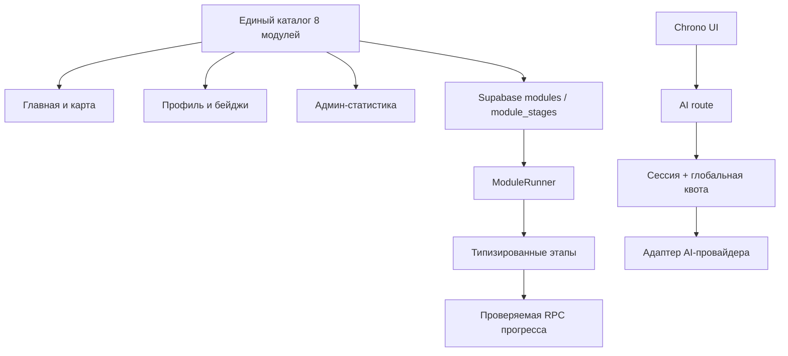

# Анализ проекта InfoQuest

**Дата аудита:** 9 августа 2026 года
**Область проверки:** весь текущий репозиторий, пользовательские маршруты, первый учебный модуль, профиль, админ-панель, Supabase, Google OAuth, AI-помощник Chrono, локализация, доступность, видео и документация.

> Это технический и продуктовый аудит текущей версии. Он не заменяет юридическую проверку политики конфиденциальности и условий использования.

## 1. Краткий вывод

InfoQuest уже выглядит как самостоятельный цифровой образовательный продукт, а не как пустой прототип. У проекта есть сильная визуальная система, двуязычный интерфейс, вход через Google, профиль с прогрессом, админ-панель, полноценный первый модуль из восьми этапов и рабочий AI-помощник с анализом текста и аудио.

При этом текущую версию **ещё рано считать готовой к открытому тестированию со школьниками**. Перед следующим публичным релизом нужно закрыть четыре блокера:

1. заменить ранее раскрытый Google OAuth Client Secret;
2. проверить исправленную финальную игру на румынском языке в браузере;
3. юридически проверить обновлённую политику и назначить приватный контакт для запросов о данных;
4. перенести лимит AI-запросов из памяти сервера в устойчивое хранилище и установить лимит расходов у провайдера.

После этого главный технический приоритет — создать единый источник данных о восьми модулях. Сейчас главная, профиль, админ-панель и Supabase описывают разное количество модулей, этапов и XP. Это уже приводит к неверной статистике и заблокирует сохранение будущих миссий.

### Оценка состояния

| Направление | Состояние | Вывод |
|---|---|---|
| Концепция и визуальный стиль | Сильное | Узнаваемый образ, понятная тема, хорошая игровая подача |
| Главная страница | Хорошее демо | Визуально готова, но щит, XP и бейджи ещё не полностью связаны с реальным прогрессом |
| Первый модуль | Функциональный прототип | Богатый контент и механики, но есть критическая RO-ошибка и тестовая разблокировка всех этапов |
| Остальные 7 модулей | Не реализованы | Карточки есть, маршруты-заглушки возвращают пустую страницу |
| Supabase и профиль | Работают | Сессия и чтение данных настроены, но модель данных расходится с UI |
| Админ-панель | Минимально работает | Показывает пользователей, но статистика и модель ролей требуют укрепления |
| AI Chrono | Работает как демо | Хороший формат ответа, но есть риски бюджета, приватности и зависания запросов |
| Доступность | Частичная | Есть focus-ring и reduced motion, но часть игр недоступна с клавиатуры, у видео нет субтитров |
| Автоматические проверки | Красная зона | TypeScript проходит, lint падает, автоматических тестов фактически нет |
| Готовность к production-пилоту | Низкая–средняя | Нужен короткий этап стабилизации до привлечения реальных учеников |

## 2. Что уже сделано хорошо

- Цельная дизайн-система: неоновая палитра, единые карточки, Orbitron/Rubik, узнаваемый щит и персонажи.
- Главная адаптируется под мобильный и большой экран; у большинства кнопок достаточный размер касания.
- На главной показаны все восемь сюжетных миссий, а доступная миссия визуально отделена от будущих.
- Первый модуль содержит вступление, теорию, два видеоэтапа, четыре игровые механики и финальную схватку.
- Профиль, модуль и админ-панель проверяют пользователя на сервере через Supabase.
- RLS включён, чтение пользовательских данных ограничено через `auth.uid()`.
- Админская RPC дополнительно проверяет администратора; выполнение для `anon` и `public` отозвано.
- OAuth-переадресация `next` ограничена внутренними маршрутами `/ru` и `/ro`.
- AI-ключ находится только на сервере; `.env.local` не отслеживается Git.
- AI-ответ имеет структурированный формат: вердикт, риск, признаки, действия и предупреждение.
- Текст AI выводится как обычный React-текст, без опасного HTML.
- Аудиофайлы и расшифровки сейчас не сохраняются приложением в Supabase.
- Для видео уже используется `preload="metadata"`, изображения персонажей подключаются через `next/image`.
- В CSS есть общий видимый фокус и поддержка `prefers-reduced-motion`.
- `npx tsc --noEmit` проходит без ошибок.
- `npm audit` не обнаружил известных уязвимостей в текущем дереве из 733 зависимостей. Это полезная проверка, но не доказательство полной безопасности.

## 3. Блокеры следующего публичного релиза — P0

### P0.1. Нужно немедленно заменить Google OAuth Client Secret

Client Secret ранее был опубликован в переписке по проекту. В текущем репозитории и его отслеживаемых файлах этот секрет не найден, но после раскрытия его всё равно следует считать скомпрометированным.

**Что сделать:**

1. создать новый Client Secret в Google Cloud;
2. заменить его в Supabase → Authentication → Providers → Google;
3. удалить старый secret в Google Cloud;
4. проверить вход на production и localhost;
5. больше не отправлять secret в чат, скриншоты или Git. Client ID секретом не является.

**Уверенность:** высокая.

### P0.2. Румынская финальная игра падала при взаимодействии — исправлено 9 августа 2026 года

В русских данных финала используются массивы `correctTargets` и `answers`, а в румынских данных — одиночные поля `correctTarget` и `answer`:

- `src/data/operator-call.ts:301-335` — RU-структура;
- `src/data/operator-call.ts:500-579` — RO-структура;
- `src/components/modules/OperatorCallModule.tsx:1128-1130` и `1230-1258` — UI без проверки вызывает `.includes()`.

Из-за `as any` TypeScript не замечал несовпадение. При клике `undefined.includes(...)` ломал экран, а route-level `error.tsx` отсутствует.

**Исправление выполнено:** RO-данные переведены на `correctTargets[]` и `answers[]`, а оба языковых финала проверяются через единый `OperatorFinalContent` с оператором `satisfies`. TypeScript и ESLint файла данных проходят. Рекомендуется дополнительно пройти финал `/ro` вручную в браузере.

**Уверенность:** высокая, ошибка подтверждена структурой данных и кодом вызова.

### P0.3. Политика не описывала реальную AI-обработку — техническая часть исправлена 9 августа 2026 года

AI-чат принимает текст, загруженное аудио и запись с микрофона. Сервер пересылает аудио на endpoint транскрипции, затем отправляет расшифровку и вопрос на внешний AI endpoint:

- `src/components/ai/AiHelpChat.tsx:187-223`;
- `src/app/api/ai/route.ts:134-188`.

Текущая политика перечисляет Google, Supabase и Vercel, но не описывает фактического AI-провайдера, голосовую запись, транскрипцию, сроки хранения у провайдера, международную передачу, удаление и возможность попадания в запись голоса третьего лица. Одновременно продукт предназначен в том числе несовершеннолетним. В политике также остался старый текст про загрузку логотипа команды, которой в текущем интерфейсе уже нет.

**Выполнено в проекте:**

- обновлены RU/RO политика и условия: категории данных, маршрут текста/аудио, BotHub, возможные поставщики моделей, международная обработка, отсутствие сохранения в Supabase и ограничения гарантий хранения;
- перед записью, загрузкой и отправкой Chrono показано предупреждение и обязательный checkbox;
- API отклоняет запрос без подтверждения и возвращает `Cache-Control: no-store`;
- добавлены запреты на пароли, SMS-коды, банковские данные, документы и чужие записи без согласия;
- усилен раздел для несовершеннолетних.

**Осталось до пилота:** назначить приватный email для запросов об удалении данных, подтвердить условия фактически используемого тарифа BotHub и передать итоговый текст специалисту по защите данных в Молдове.

**Уверенность:** высокая по несоответствию документа коду; правовые формулировки требуют отдельной экспертизы.

### P0.4. Авторизация и пользовательская AI-квота исправлены; остаётся лимит бюджета провайдера

**Исправлено 9 августа 2026 года:** страница Chrono и `src/app/api/ai/route.ts` требуют действующую Supabase-сессию. Гость перенаправляется на Google-вход и после авторизации возвращается в Chrono. В Supabase добавлена атомарная квота — не более 3 аудиоанализов в сутки на пользователя — и блокировка второго одновременного AI-запроса. Ответы API получают `Cache-Control: no-store`.

Дополнительный короткий burst-лимит — восемь запросов за десять минут — остаётся в памяти Vercel, но больше не является единственной защитой: постоянная аудиоквота и блокировка параллельной обработки хранятся в Supabase.

**Осталось:**

- установить spending limit у AI-провайдера;
- при росте аудитории добавить общий дневной бюджет проекта, чтобы большое число разных аккаунтов не исчерпало баланс одновременно.

**Уверенность:** высокая.

## 4. Высокий приоритет — P1

### P1.1. Единый каталог восьми модулей — исправлено 9 августа 2026 года

В `src/data/module-catalog.ts` зафиксированы канонические ID, порядок, локализованные названия, доступность, маршруты, бейджи, восемь этапов и распределение 100 XP на модуль. Главная, профиль и админ-панель используют этот каталог и единые итоги: 8 модулей, 64 этапа, 800 XP.

В Supabase добавлены `module_catalog` и `module_stage_catalog`. Жёсткие списки пяти ID в `CHECK`-ограничениях, seed-функции, RPC завершения этапа и админской статистике заменены внешними ключами и чтением каталога. Существующим пользователям добавлены недостающие строки прогресса для всех восьми модулей.

Проверка реальной базы подтверждает: каждый пользователь имеет 8 строк модулей и 64 строки этапов; RPC принимает канонический ID шестой миссии, а админ-панель возвращает 64 этапа и 8 элементов разбивки.

### P1.2. Прогресс, XP и оценки сейчас можно подделать

- RLS позволяет авторизованному пользователю напрямую обновлять собственные `status`, `score`, `xp` и `attempts`.
- RPC `complete_module_stage` принимает от клиента номер этапа и score без проверки порядка.
- `OperatorCallModule.tsx:65-67` временно открывает все этапы строкой `return 8; // Unlock all stages for testing`.
- Этапы 4, 6, 7 и 8 отправляют фиксированные 100 баллов.
- Счётчик `attempts` из-за `greatest(existing, excluded)` фактически не растёт выше единицы.

Для обычной локальной демонстрации это допустимо, но данным админ-панели нельзя доверять.

**Решение:** отозвать прямые `insert/update` прогресса, оставив безопасные RPC; проверять предыдущий этап и доступность модуля; вычислять XP на сервере; для игровых этапов отправлять ответы или подтверждаемые результаты; увеличивать attempts атомарно.

### P1.3. Главная показывает декоративный, а не реальный прогресс

Header уже загружает XP и число наград из Supabase, но центральный щит всегда показывает `0%` и `0/8`, а все бейджи остаются заблокированными. CTA «Начать расследование» всегда ведёт на login, даже если пользователь уже вошёл.

**Решение:** загрузить прогресс один раз на сервере или через единый hook, передать его в header, щит, бейджи и CTA. Для вошедшего пользователя CTA должен вести в первый незавершённый этап или профиль.

### P1.4. Игровая последовательность отключена тестовым кодом

Все восемь этапов первого модуля доступны сразу. Это позволяет пропустить теорию и видео, перейти в финал и нарушает образовательный сценарий.

**Решение:** `unlockedThrough = первый незавершённый этап`; тестовую разблокировку оставить только в development или для подтверждённого администратора через явный feature flag. Никогда не коммитить тестовый режим как production-поведение.

### P1.5. Несколько игр недоступны с клавиатуры

В диалоге и финальной игре интерактивными сделаны обычные `span`, `div` и `p` с `onClick`. Они не попадают в Tab-порядок и не имеют клавиатурной активации. Жёсткие таймеры 10–12 секунд нельзя поставить на паузу или продлить.

**Решение:** использовать настоящие `button`; добавить видимый фокус, `aria-live` для результата и режим без таймера/продление времени. Это особенно важно для школьников с моторными, зрительными и когнитивными ограничениями.

### P1.6. Видео не имеют субтитров

Видео первого модуля и демонстрационное видео выводятся без `<track kind="captions">`. Текст рядом с видео полезен, но не заменяет синхронные субтитры.

**Решение:** подготовить RO/RU WebVTT, добавить `track`, расшифровку и локализованный постер. Проверить, что язык аудио соответствует выбранному маршруту.

### P1.7. Локализация настроена наполовину

- `next-intl` установлен и подключён к маршрутизации, но `messages/ru.json` и `messages/ro.json` практически пусты.
- Переводы распределены по большим объектам в home, module, login, profile, admin, AI и footer.
- `<html lang="ru">` жёстко задан даже на серверных `/ro/*` страницах.
- В румынской финальной игре остаются строки «Улики», `HP`, `Boss HP`; общие `Intro`, `Language`, `Close` также местами зашиты.

**Решение:** получать locale в layout и задавать корректный `lang`; перенести UI-строки в `next-intl`; контент миссии хранить отдельно от системных переводов; добавить проверку отсутствующих ключей и человеческую вычитку RO/RU.

### P1.8. AI-вызовы могут зависнуть до таймаута Vercel

Оба внешних `fetch` не имеют `AbortSignal` и таймаута. `request.formData()` расположен вне `try`, а ограничение 4 МБ проверяется только после загрузки multipart-тела в память.

**Решение:** добавить таймаут 25–40 секунд, обработку 408/429/502, кнопку «Остановить», проверку `Content-Length`, сигнатуры и длительности аудио, ограничение transcript и адаптер провайдера вместо логики BotHub/OpenAI в одном route.

### P1.9. Quality gate не проходит, тестов фактически нет

Результаты проверок:

| Проверка | Результат |
|---|---|
| `npx tsc --noEmit` | Проходит |
| `npm run lint` | Не проходит: 38 ошибок, 23 предупреждения |
| `npx playwright test --list` | 0 тестов в 0 файлах |
| `tests/e2e/full-journey.spec.ts` | Пустой файл |
| `npm run build` | Не завершился: окружение не смогло скачать Orbitron/Rubik из Google Fonts |
| `npm audit` | 0 известных уязвимостей в 733 зависимостях |

Сбой build не доказывает ошибку production-кода: проверка остановилась на сетевой загрузке шрифтов. Но это показывает, что сборка не воспроизводится в offline/restricted окружении.

**Решение:** локально хранить шрифты через `next/font/local`; исправить lint до нуля; удалить или исключить одноразовые `scratch/update-*.js`; добавить `typecheck`, `test`, `test:e2e`; настроить CI `lint → typecheck → tests → build`.

## 5. Видео и медиа

`public` занимает **92 817 572 байта (88,52 МиБ)**. Видео занимают около **79,61 МиБ**. Самые тяжёлые файлы:

| Файл | Размер |
|---|---:|
| `public/video/2-video_ro.mp4` | 39,04 МиБ |
| `public/video/2-video_ru.mp4` | 33,86 МиБ |
| `public/promo.mp4` | 2,66 МиБ |
| `public/promo_ro.mp4` | 2,44 МиБ |

На мобильном интернете два учебных видео будут главной причиной долгой загрузки и расхода трафика.

### Рекомендуемая медиа-стратегия

1. Перекодировать короткие ролики в web-friendly 720p H.264/AAC с `faststart`; при необходимости добавить WebM как альтернативу.
2. Проверять качество по реальному телефону, а не только по размеру. Для короткого учебного ролика разумно стремиться к нескольким мегабайтам, а не 30–40 МиБ.
3. Добавить постер, RO/RU WebVTT и полную текстовую расшифровку.
4. Загружать видео только при открытии соответствующего этапа; не включать весь контент модуля в начальную загрузку.
5. При появлении нескольких модулей перенести видео в object storage/CDN и использовать HLS/adaptive streaming.
6. Установить media budget в CI: предупреждение при резком росте размера файла.
7. Нормализовать имена: `operator-call-explanation.ru.mp4`, `operator-call-explanation.ro.mp4`, соответствующие `.vtt` и `.jpg`.

Текущее `preload="metadata"` следует сохранить — это правильная основа.

## 6. Архитектура и поддерживаемость — P2

### 6.1. Первый модуль уже стал монолитом

- `src/components/modules/OperatorCallModule.tsx` — 1319 физических строк;
- `src/data/operator-call.ts` — 718 строк;
- `src/components/ai/AiHelpChat.tsx` — около 420 строк;
- главная — около 474 физических строк.

В одном компоненте смешаны навигация, таймеры, звуки, сохранение, восемь этапов и пять игровых механик. Копирование такого файла для семи миссий резко увеличит число ошибок.

**Решение:** общий `ModuleRunner`, строгий discriminated union типов этапов, отдельные компоненты `stages/*`, общий `useStageCompletion`, reducer/state machine для игр и ленивое подключение тяжёлых этапов.

### 6.2. Нет типизированной границы Supabase

`src/lib/types.ts` пуст, а данные из Supabase приводятся вручную. Это одна из причин, по которой расхождение схемы не видно при TypeScript-проверке.

**Решение:** генерировать `Database` types из Supabase CLI, типизировать клиенты, RPC и ответы; убрать `any` и ручные cast.

### 6.3. Главная целиком является Client Component

Большая часть главной статична, но весь `page.tsx` гидратируется в браузере. Тяжёлый модуль также загружает все игровые этапы и оба языковых набора сразу.

**Решение:** серверная оболочка + небольшие client islands для header, слайдера и modal; динамически импортировать игры только для активного этапа.

### 6.4. Нет route-level устойчивости

В `src/app` отсутствуют локализованные `loading.tsx`, `error.tsx` и нормальный `not-found.tsx`. Ошибка одного этапа может сломать весь экран. Profile частично игнорирует ошибки запросов, а admin при RPC-ошибке скрывает причину редиректом.

**Решение:** добавить error/loading boundaries, retry и безопасное журналирование кода ошибки.

### 6.5. Supabase production используется как скрытый fallback

Production URL и publishable key повторены как fallback в `client.ts`, `server.ts` и `proxy.ts`. Publishable key не является секретом, но при ошибке переменных локальная сборка незаметно подключится к production.

**Решение:** единый валидатор env с fail-fast и отдельные Supabase проекты для development, preview и production.

### 6.6. Админские роли дублируются

Два email записаны и во frontend-коде, и в SQL. Добавление второго администратора выполнено строковой заменой определения функции. Эти источники могут разойтись.

**Решение:** хранить админов по подтверждённому Supabase UUID или `app_metadata.role`; включить MFA/AAL2 для админов; журналировать административный доступ; показывать минимум персональных данных. Адрес второго администратора `pucalmaria@gmail.com` следует подтвердить лично до пилота.

### 6.7. Админка не масштабируется

RPC возвращает всех пользователей сразу, а страница строит восемь карточек для каждого. При росте базы интерфейс и запрос станут медленными.

**Решение:** серверная пагинация, поиск, сортировка, фильтр по модулю и отдельный агрегат статистики.

## 7. UX, доступность и контент — P2

- `Modal` закрывается Escape, но не переводит фокус внутрь, не удерживает его, не делает фон inert и не возвращает фокус. Лучше использовать доступный Dialog primitive.
- Скрытая кнопка «Наверх» остаётся в Tab-порядке, когда визуально невидима.
- Typewriter-анимация intro не учитывает reduced motion; нужна кнопка «Показать весь текст».
- У AI textarea нужен явный label; кнопке удаления вложения — доступное имя; состоянию «Chrono думает» — screen-reader status.
- При риске ровно 70% рамка жёлтая, а шкала красная. Пороговые значения должны исходить из одной функции.
- Десять полос Boss HP могут переполнить маленький экран; нужен перенос или компактный индикатор.
- Автослайдер объявляет каждый автоматический слайд через `aria-live`, что может раздражать пользователей screen reader. Объявлять нужно только ручное переключение.
- Footer показывает другой состав команды, хотя правильные имена уже есть в `home-data.ts`.
- Сюжет всё ещё говорит о пяти «трещинах», хотя интерфейс обещает восемь миссий.
- QR-код ведёт на корень и не сохраняет выбранный язык.
- Для детской/классной аудитории стоит рассмотреть гостевой режим с локальным прогрессом, оставив Google-вход опциональным для синхронизации. Это уменьшит барьер входа и объём данных несовершеннолетних.
- После исправления доступности провести короткое тестирование минимум с 5–8 пользователями каждого языка: один телефон, один ноутбук, клавиатура без мыши и медленная сеть.

## 8. Незавершённые и устаревшие части

- Семь маршрутов (`intro`, `map`, `results` и четыре будущих модуля) возвращают `null`, то есть пустой экран при прямом открытии. Нужны `notFound()` или локализованная страница «Скоро».
- Несколько компонентов игрового движка, `game-store.ts`, `scoring.ts`, `storage.ts`, `types.ts`, JSON-сценарии и E2E-файл пусты или не подключены.
- В главной остались мёртвые imports, state и QR-логика после переноса в footer.
- Установлены, но фактически не используются `zustand`, `@base-ui/react`, `class-variance-authority` и часть shadcn-заготовок.
- `README.md` не описывает Supabase, миграции, Google OAuth, AI, переменные окружения и реальный запуск тестов.
- `.env.example` по умолчанию всё ещё указывает TokenRouter, тогда как текущая production-настройка обсуждалась для BotHub. Документация и фактический провайдер должны совпадать.
- `analysis_results.md` описывает старую структуру проекта и уже не соответствует коду. Его следует архивировать или заменить ссылкой на этот аудит.
- Старый MVP-план обещает пять доступных миссий, текущий продукт сознательно открывает только одну. Нужно официально зафиксировать актуальный scope, чтобы команда не ориентировалась на разные планы.
- Нет sitemap, robots, OpenGraph, canonical и `hreflang` для RU/RO.

## 9. Дополнительное укрепление безопасности — P2/P3

- Добавить CSP, `frame-ancestors`, `Referrer-Policy` и `Permissions-Policy: microphone=(self)`.
- OAuth callback строит origin из forwarded headers. На Vercel это обычно контролирует платформа, но безопаснее использовать allowlisted `SITE_URL`.
- Проверять `Content-Type`, `Content-Length`, сигнатуру, длительность аудио и обрезать слишком длинную расшифровку.
- Ограничить AI endpoint по пользователю, дню, IP и общему бюджету.
- Не хранить тексты и записи без отдельного согласия. Если появится история проверок, добавить срок автоудаления.
- Ограничить длину `display_name` и `avatar_url` в базе.
- Подтвердить личность каждого администратора и включить MFA.
- Проверить фактически применённые миграции/RLS в production Supabase: аудит репозитория не доказывает, что live-база полностью совпадает с SQL-файлами.

## 10. Рекомендуемая целевая архитектура



Предлагаемая структура:

```text
src/
  config/
    modules.ts
  features/
    modules/
      runner/
      stages/
      operator-call/
    progress/
    ai-help/
    admin/
  lib/
    env.ts
    supabase/
      database.types.ts
  messages/
    ru.json
    ro.json
supabase/
  migrations/
tests/
  unit/
  integration/
  e2e/
```

## 11. Дорожная карта

Оценки ниже ориентировочные и не включают производство новых видео.

### Этап A. Срочная стабилизация — 1–3 рабочих дня

1. Ротировать Google OAuth secret.
2. Исправить контракт данных румынского финала.
3. Вернуть последовательную разблокировку этапов.
4. Закрыть AI сессией/устойчивой квотой и добавить timeout.
5. Обновить privacy/terms и предупреждение перед AI-отправкой.
6. Исправить критические lint-ошибки.

### Этап B. Единый фундамент — 3–6 рабочих дней

1. Утвердить канонические ID восьми модулей.
2. Создать единый каталог и миграцию Supabase на 8 × 8 этапов.
3. Исправить XP, щит, бейджи и admin denominators.
4. Генерировать Supabase types.
5. Перенести роли админов в UUID/role claims.
6. Настроить staging и fail-fast env.

### Этап C. Качество первого модуля — 3–7 рабочих дней

1. Разбить `OperatorCallModule` на runner и этапы.
2. Убрать `any`, вычислять реальные результаты игр.
3. Исправить клавиатуру, таймеры, modal и mobile HP.
4. Добавить субтитры, постеры и сжать видео.
5. Централизовать локализацию.
6. Добавить unit/integration/E2E и CI.

### Этап D. Производство остальных модулей

Для каждого нового модуля использовать один шаблон Definition of Done: контент RU/RO → human review → 8 типизированных этапов → сохранение прогресса → клавиатура → субтитры → мобильная проверка → тест контракта → E2E smoke.

Сначала разумно закончить второй модуль на новом общем runner. Если он реализуется без копирования монолита, архитектура готова к масштабированию ещё на шесть миссий.

## 12. Первые 15 конкретных задач

| № | Задача | Приоритет | Эффект | Сложность |
|---:|---|---|---|---|
| 1 | Ротировать раскрытый Google secret | P0 | Закрывает риск OAuth | Низкая |
| 2 | Унифицировать RO/RU поля финальной игры | P0 | Убирает падение RO | Низкая |
| 3 | Обновить privacy и AI consent | P0 | Снижает риск для пользователей и команды | Средняя |
| 4 | Авторизация и глобальная квота AI | P0 | Защищает бюджет | Средняя |
| 5 | Вернуть последовательное открытие 8 этапов | P1 | Восстанавливает учебный маршрут | Низкая |
| 6 | Единый каталог 8 модулей | P1 | Убирает системные расхождения | Средняя |
| 7 | Миграция Supabase на 8 модулей/64 этапа | P1 | Позволяет развивать продукт | Средняя |
| 8 | Серверная проверка прогресса и XP | P1 | Делает статистику достоверной | Средняя–высокая |
| 9 | Связать щит и бейджи с Supabase | P1 | Делает главную честной и мотивирующей | Средняя |
| 10 | Исправить клавиатурное управление | P1 | Делает игры доступнее | Средняя |
| 11 | Субтитры и сжатие двух больших видео | P1 | Улучшает доступность и скорость | Средняя |
| 12 | AI timeout/cancel и безопасный multipart | P1 | Убирает зависания и лишнюю нагрузку | Средняя |
| 13 | Довести lint до нуля | P1 | Возвращает надёжный quality gate | Средняя |
| 14 | Добавить минимальный E2E и CI | P1 | Предотвращает повторные поломки | Средняя |
| 15 | Разбить первый модуль на runner/stages | P2 | Упрощает следующие 7 модулей | Высокая |

## 13. Минимальный набор тестов

### Контракт и unit

- RU и RO имеют одинаковую структуру каждого этапа;
- все восемь module ID уникальны и совпадают с БД;
- сумма XP модуля равна 100;
- риск Chrono имеет единые пороги `<30`, `30–70`, `>70`;
- неполные AI-ответы безопасно отклоняются.

### Supabase integration

- пользователь не читает чужой профиль/прогресс;
- пользователь не изменяет XP напрямую;
- нельзя завершить этап 8 до этапов 1–7;
- обычный пользователь не вызывает admin RPC;
- подтверждённый admin получает только необходимые поля;
- шестой, седьмой и восьмой модули корректно сохраняются.

### E2E

- `/ru` и `/ro` имеют правильный `html lang`;
- Google callback ведёт в соответствующий профиль;
- первый модуль последовательно проходит все 8 этапов на RU и RO;
- перезагрузка сохраняет прогресс;
- завершение открывает бейдж, XP и щит;
- AI text и audio показывают timeout/error без зависания;
- клавиатурой можно пройти весь игровой путь;
- закрытые маршруты показывают «Скоро», а не пустую страницу.

## 14. Definition of Done для следующего публичного пилота

- Все P0 закрыты.
- `lint`, `typecheck`, tests и production build проходят в CI.
- RU и RO проходят один и тот же E2E-маршрут.
- Ни один этап не падает при ошибочных/пустых данных.
- Прогресс и XP нельзя изменить прямым клиентским запросом.
- Главная, профиль и admin используют один каталог модулей.
- Политика описывает фактический OAuth, Supabase и AI-аудио поток.
- У каждого видео есть субтитры и расшифровка; тяжёлые файлы оптимизированы.
- Все действия доступны с клавиатуры, таймеры имеют доступную альтернативу.
- AI имеет устойчивую квоту, timeout, spending cap и безопасное состояние ошибки.
- Есть отдельный staging; отсутствие env не подключает разработчика к production Supabase.
- Реальные RO/RU пользователи прошли короткий usability-тест, а найденные блокеры исправлены.

## 15. Ограничения аудита

Проверены код, локальные файлы, миграции и доступные команды. Не проверялись вручную:

- фактически применённая схема и RLS live-проекта Supabase;
- настройки Google OAuth и Vercel в консолях;
- правила хранения и обучения данных фактического AI-провайдера;
- реальная производительность на мобильной сети;
- screen reader на физическом устройстве;
- юридическая корректность документов по законодательству Молдовы.

Поэтому выводы о коде и рассинхронизации схемы имеют высокую уверенность; выводы о production-консолях, юридическом соответствии и реальном UX требуют отдельной проверки.
