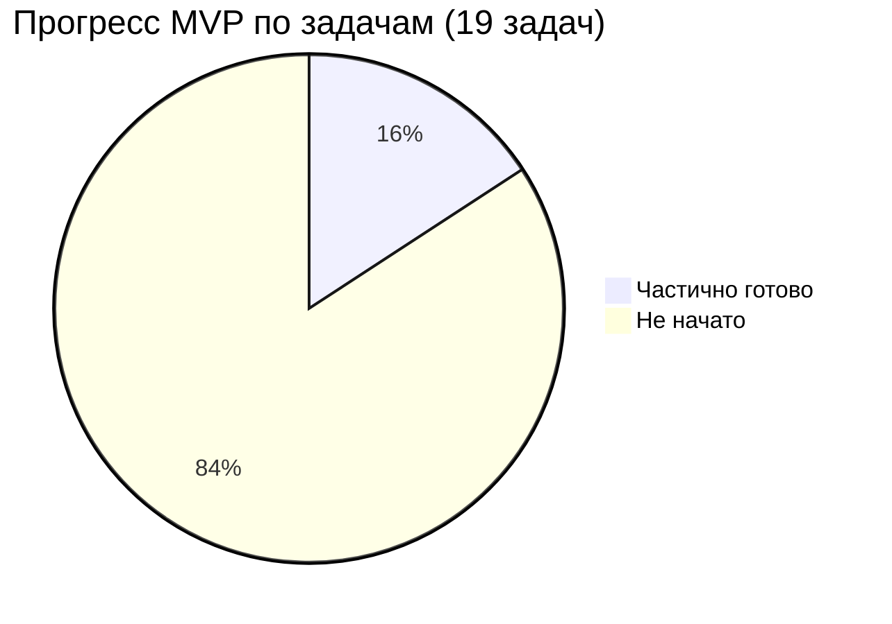
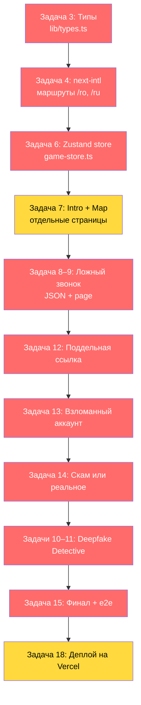

# 🔍 Анализ проекта InfoQuest Cahul

## Общая картина

**InfoQuest Cahul** — двуязычная (RO/RU) образовательная игра о цифровой безопасности для жителей юга Молдовы. MVP предназначен для хакатона и должен включать 5 интерактивных миссий, карту с 8 точками и финальный экран.

---

## 1. Текущее состояние проекта

### ✅ Что реализовано

| Компонент | Статус | Файлы |
|-----------|--------|-------|
| Next.js 16 + TypeScript + Tailwind 4 | ✅ Готово | [package.json](file:///d:/SASS/infoquest/package.json) |
| Дизайн-система (цвета, шрифты, утилиты) | ✅ Готово | [globals.css](file:///d:/SASS/infoquest/src/app/globals.css) |
| Корневой layout с Orbitron + Rubik | ✅ Готово | [layout.tsx](file:///d:/SASS/infoquest/src/app/layout.tsx) |
| Домашняя страница-витрина | ✅ Готово | [home-page.tsx](file:///d:/SASS/infoquest/src/features/home/components/home-page.tsx) |
| Данные 8 миссий + двуязычные строки | ✅ Готово | [home-data.ts](file:///d:/SASS/infoquest/src/features/home/home-data.ts) |
| Переключатель языка (RO/RU) + localStorage | ✅ Готово | встроен в HomePage |
| Карта 8 миссий (визуальная) | ✅ Готово | встроена в HomePage |
| Модальные окна миссий | ✅ Готово | встроены в HomePage |
| QR-код + загрузка SVG | ✅ Готово | встроен в HomePage |
| Загрузка логотипа команды | ✅ Готово | встроена в HomePage |
| Блок «Щит города» + прогресс-бар | ✅ Готово | ShieldProgress |
| shadcn/ui (base-nova стиль) | ✅ Настроен | [components.json](file:///d:/SASS/infoquest/components.json) |
| Framer Motion, Zustand, next-intl | ✅ Установлены | package.json |
| Playwright | ✅ Установлен | package.json |
| `prefers-reduced-motion` | ✅ Готово | globals.css L167-176 |

### ❌ Что НЕ реализовано (из MVP-спецификации)

| Компонент | Приоритет | Задачи из плана |
|-----------|-----------|-----------------|
| **Локализация через next-intl** (маршруты `/ro`, `/ru`) | 🔴 Критично | Задача 4 |
| **Типы GameScene / GameChoice** | 🔴 Критично | Задача 3 |
| **Zustand game-store** | 🔴 Критично | Задача 6 |
| **Стартовый экран → Intro → Map** (отдельные страницы) | 🔴 Критично | Задача 7 |
| **Модуль «Ложный звонок»** | 🔴 Критично | Задачи 8–9 |
| **Модуль «Ловушка поддельной ссылки»** | 🔴 Критично | Задача 12 |
| **Модуль «Взломанный аккаунт»** | 🔴 Критично | Задача 13 |
| **Модуль «Мошенничество или реальное предложение?»** | 🔴 Критично | Задача 14 |
| **Модуль «Детектив по дипфейкам»** | 🔴 Критично | Задачи 10–11 |
| **Финальный экран с результатами** | 🔴 Критично | Задача 15 |
| **JSON-сценарии модулей** (`data/*.json`) | 🔴 Критично | Задачи 3, 8, 10, 12–14 |
| **Игровые компоненты** (ChoiceCard, TheoryCard, ConsequencePanel и др.) | 🔴 Критично | Задачи 5, 9, 11–14 |
| **Аудио/видео контент** | 🟡 Важно | Задачи 8, 10 |
| **e2e тест full-journey** | 🟡 Важно | Задача 15 |
| **Деплой на Vercel** | 🟡 Важно | Задача 18 |

---

## 2. Архитектурные расхождения между планом и реализацией

### 2.1 Структура файлов

> [!WARNING]
> Текущая структура **существенно отличается** от запланированной в разделе 5 спецификации.

**По плану:**
```
app/[locale]/layout.tsx
app/[locale]/page.tsx
app/[locale]/intro/page.tsx
app/[locale]/map/page.tsx
app/[locale]/modules/operator-call/page.tsx
...
components/game/...
components/media/...
data/*.json
lib/game-store.ts
messages/ro.json, ru.json
```

**Фактически:**
```
src/app/layout.tsx          ← нет [locale] сегмента
src/app/page.tsx            ← делегирует в features/home
src/features/home/          ← feature-based структура вместо app/components
src/lib/utils.ts            ← только cn()
```

**Ключевые расхождения:**

| Аспект | План | Факт |
|--------|------|------|
| Каталог `src/` | Не указан, но допустим | Используется ✅ |
| Маршруты `[locale]` | `app/[locale]/...` | Отсутствуют ❌ |
| Локализация | next-intl с middleware | Ручной state в useState ❌ |
| Данные миссий | `data/*.json` файлы | Встроены в `home-data.ts` ⚠️ |
| Компоненты | `components/game/`, `components/media/` | `features/home/components/` ⚠️ |
| Game store | `lib/game-store.ts` (Zustand) | Отсутствует ❌ |
| Типы | `lib/types.ts` | Отсутствуют ❌ |

### 2.2 Локализация

> [!IMPORTANT]
> Текущая локализация реализована через `useState` + inline-словарь в `home-data.ts`. Это работает для одностраничной витрины, но **не масштабируется** для 5+ игровых страниц. По плану нужен `next-intl` с middleware и `messages/ro.json` / `ru.json`.

### 2.3 Данные миссий

Текущие данные в [home-data.ts](file:///d:/SASS/infoquest/src/features/home/home-data.ts) содержат только `title` и `teaser` для каждой миссии. По плану каждый модуль должен иметь полный JSON-сценарий с типами `GameScene[]`, включая:
- сюжетные вступления
- выборы с последствиями
- теоретические карточки
- аудио/видео-сцены
- доски доказательств

### 2.4 Порядок миссий

> [!WARNING]
> Порядок и доступность миссий **не совпадают** с планом.

| # | План (сюжетный порядок) | Статус по плану | home-data.ts | Статус в home-data |
|---|------------------------|----------------|--------------|--------------------|
| 1 | Ложный звонок | ✅ Доступен | id=2, PhoneCall | ✅ playable |
| 2 | Ловушка поддельной ссылки | ✅ Доступен | id=8, Link2Off | ❌ **soon** |
| 3 | Взломанный аккаунт | ✅ Доступен | id=1, UserLock | ❌ **soon** |
| 4 | Мошенничество или реальное предложение? | ✅ Доступен | id=3, Gift | ❌ **soon** |
| 5 | Детектив по дипфейкам | ✅ Доступен | id=4, ScanFace | ✅ playable |
| 6 | Двуязычный детектив | ❌ Скоро | id=5, Languages | ❌ **playable** ⚠️ |
| 7 | Город в осаде слухов | ❌ Скоро | id=6, MapPin | ✅ soon |
| 8 | Защити сообщество от троллей | ❌ Скоро | id=7, ShieldAlert | ✅ soon |

**Проблемы:**
- Миссии 1 (Взломанный аккаунт), 3 (Скам), 8 (Поддельная ссылка) помечены «soon», хотя по плану должны быть доступны
- Миссия 5 (Двуязычный детектив) помечена «playable», хотя по плану это «Скоро»
- Нумерация `id` не соответствует сюжетному порядку

---

## 3. Качество текущего кода

### ✅ Сильные стороны

1. **Дизайн-система** — продуманная цветовая палитра с oklch(), неоновые свечения, glassmorphism-эффекты, хороший тёмный фон
2. **Доступность** — `aria-label`, `role="progressbar"`, `focus-ring`, `prefers-reduced-motion`
3. **Адаптивность** — десктоп (3-колоночная сетка) vs мобильные (стек)
4. **Визуал** — щит с анимацией пульса, dash-анимация SVG-путей, backdrop-blur
5. **Компоненты** — Modal, MissionCard, BottomCard чистые и переиспользуемые

### ⚠️ Проблемные места

1. **Монолитная страница** — все 441 строк в одном файле `home-page.tsx`. Modal, Header, MissionCard и другие должны быть отдельными компонентами
2. **Нет маршрутизации** — всё на одной странице, нет перехода к игровым модулям
3. **Жёсткая привязка языка к `<html lang="ru">`** в layout.tsx — должно определяться динамически
4. **Нет обработки ошибок** — отсутствуют `error.tsx`, `loading.tsx`
5. **Нет `middleware.ts`** — необходим для next-intl маршрутизации
6. **Карта миссий — визуальная, но не функциональная** — клик открывает модальное с «Скоро» / «Доступно», но не ведёт в игру

---

## 4. Оценка прогресса относительно MVP



| Задача | Описание | Прогресс |
|--------|----------|----------|
| 1. Требования | Зафиксировать критерии | 🟡 50% (есть spec, нет docs/) |
| 2. Создать проект | Next.js каркас | ✅ 90% (нет next-intl настройки) |
| 3. Типы данных | GameScene, GameChoice | ❌ 0% |
| 4. Локализация | next-intl, `/ro`, `/ru` | ❌ 0% (есть ручная) |
| 5. Дизайн-система | Цвета, компоненты | 🟡 60% (есть CSS, нет игровых компонентов) |
| 6. Zustand store | Прогресс игры | ❌ 0% |
| 7. Стартовый/Карта | Отдельные страницы | 🟡 40% (есть на одной странице) |
| 8. Контент «Ложный звонок» | JSON + аудио | ❌ 0% |
| 9. Модуль «Ложный звонок» | Игровой экран | ❌ 0% |
| 10. Контент Deepfake | JSON + видео | ❌ 0% |
| 11. Модуль Deepfake | Игровой экран | ❌ 0% |
| 12. Модуль «Поддельная ссылка» | Игровой экран | ❌ 0% |
| 13. Модуль «Взломанный аккаунт» | Игровой экран | ❌ 0% |
| 14. Модуль «Скам или реальное?» | Игровой экран | ❌ 0% |
| 15. Финал и результаты | Экран + e2e | ❌ 0% |
| 16. Доступность | Минимум a11y | 🟡 30% (базовое есть) |
| 17. Экспресс-тест | Тестирование | ❌ 0% |
| 18. Деплой | Vercel | ❌ 0% |
| 19. Презентация | 5-мин демо | ❌ 0% |

**Общий прогресс: ~15%** — готова визуальная витрина, но игровой движок и контент не начаты.

---

## 5. Критический путь к MVP



---

## 6. Конкретные рекомендации

### 6.1 Немедленно (инфраструктура)

1. **Создать `lib/types.ts`** с типами `LocalizedText`, `GameChoice`, `GameScene`, `GameProgress`
2. **Настроить next-intl** — `middleware.ts`, `messages/ro.json`, `messages/ru.json`, `app/[locale]/layout.tsx`
3. **Создать Zustand store** — `lib/game-store.ts` с persist в localStorage
4. **Исправить порядок и статус миссий** в `home-data.ts` — привести в соответствие с планом

### 6.2 Следующий шаг (игровые компоненты)

5. **Вынести общие компоненты**: `GameShell`, `ChoiceCard`, `TheoryCard`, `ConsequencePanel`, `ProgressHeader`
6. **Создать JSON-сценарии** для каждого из 5 модулей
7. **Реализовать игровой движок** — универсальный рендерер сцен по массиву `GameScene[]`

### 6.3 Миссии (по приоритету из плана)

8. «Ложный звонок» — флагманская, с аудио
9. «Ловушка поддельной ссылки» — компактная
10. «Взломанный аккаунт» — компактная
11. «Мошенничество или реальное предложение?» — компактная
12. «Детектив по дипфейкам» — флагманская, с видео

### 6.4 Финализация

13. Финальный экран с бейджами
14. e2e тест
15. Деплой

---

## 7. Технические замечания

| Заметка | Детали |
|---------|--------|
| **Next.js 16.3** | Очень свежая версия; проверить совместимость с `next-intl@4` |
| **`LayoutProps<"/">`** | Нестандартный тип в layout.tsx — проверить, что это типизация Next 16 |
| **`agentRules: false`** | Странное поле в next.config.ts — не документировано в Next.js |
| **`jsx: "react-jsx"`** | В tsconfig.json — Next.js обычно использует `"preserve"`, но для Next 16 это может быть нормально |
| **Exclude `infoquest-digital-guard-main`** | В tsconfig и eslint — видимо, был старый проект в этой же директории |
| **Zustand v5** | Установлен, но не используется |
| **next-intl v4** | Установлен, но не настроен |
| **Framer Motion v13** | Установлен, но не используется |

---

## 8. Резюме

> [!IMPORTANT]
> Проект имеет **крепкую визуальную основу** (красивая витрина, продуманная дизайн-система), но **игровой движок полностью отсутствует**. Из 19 задач MVP-плана ~15% выполнено. Предстоит создать: систему типов, маршрутизацию с локализацией, хранилище состояния, 5 игровых модулей с JSON-сценариями, финальный экран, и развернуть на Vercel.

**Следующий шаг:** решить, начинаем ли реализацию по плану, и с какой задачи. Рекомендую начать с задач 3→4→6 (типы → next-intl → Zustand store) как фундамента для всех модулей.
