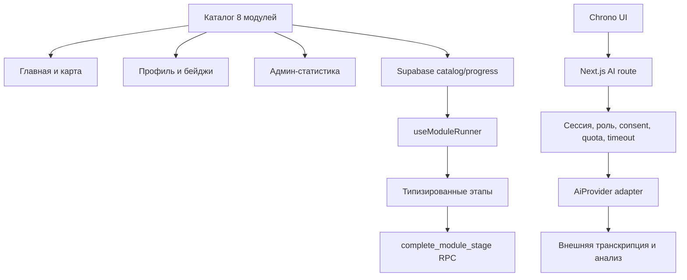

# Полное описание приложения InfoQuest

**Версия документа:** 1.0

**Дата актуализации:** 12 августа 2026 года

**Production:** https://infoquest-cahul.vercel.app

## 1. Общая информация

InfoQuest — двуязычное образовательное веб-приложение в формате сюжетной игры о цифровой безопасности. Оно помогает школьникам, учителям, семьям и участникам местного сообщества распознавать телефонное и интернет-мошенничество, безопасно реагировать на давление, проверять информацию и защищать свои аккаунты и персональные данные.

Приложение работает на русском и румынском языках. Каждая локализация имеет собственный маршрут:

- `/ru` — русская версия;
- `/ro` — румынская версия.

Главная идея проекта — «цифровой щит сообщества». Пользователь проходит расследования, закрывает «трещины» щита, получает XP и бейджи. В общей истории действует противник «Тень», распространяющий мошеннические звонки, ложные ссылки, взломы, дипфейки, слухи и конфликты.

## 2. Назначение приложения

InfoQuest решает три задачи:

1. Обучает цифровой безопасности через короткие объяснения, видео и практику.
2. Проверяет понимание через разные игровые механики, а не только обычный тест.
3. Даёт учителям и организаторам минимальную статистику прохождения пользователей.

После первого модуля пользователь должен понимать:

- почему нельзя сообщать код из SMS, пароль или PIN;
- как мошенники используют срочность, страх, угрозы и авторитет;
- почему номер звонящего может быть подменён;
- почему нельзя переходить по присланной звонящим ссылке;
- как завершить подозрительный разговор и самостоятельно связаться с организацией по официальному каналу.

## 3. Целевая аудитория

Основная аудитория:

- школьники и молодёжь от 13 лет;
- учителя и наставники;
- родители и семьи;
- молодёжные центры и общественные организации;
- русскоязычные и румыноязычные жители сообщества.

Приложение задумано как инструмент индивидуального обучения, демонстрации на уроке и проведения группового пилота. Для участия несовершеннолетних правила согласия, законное основание обработки данных и формат сопровождения должны быть подтверждены специалистом до публичного пилота.

## 4. Текущий объём MVP

В интерфейсе и базе описаны восемь модулей. В текущем MVP полностью доступен только первый модуль. Остальные семь показываются как будущие и имеют статус «Скоро».

| № | ID | Название RU | Название RO | Статус |
|---:|---|---|---|---|
| 1 | `operator-call` | Фальшивый звонок оператора | Apelul fals de la operator | Доступен |
| 2 | `fake-link` | Ловушка фальшивой ссылки | Capcana linkului fals | Скоро |
| 3 | `hacked-account` | Взломанный аккаунт | Contul compromis | Скоро |
| 4 | `scam-or-real` | Скам или реальное предложение? | Scam sau ofertă reală? | Скоро |
| 5 | `deepfake-detective` | Детектив дипфейков | Deepfake Detective | Скоро |
| 6 | `bilingual-detective` | Двуязычный детектив | Detectivul bilingv | Скоро |
| 7 | `rumor-city` | Город под осадой слухов | Orașul sub asediul zvonurilor | Скоро |
| 8 | `community-trolls` | Защити сообщество от троллей | Apără comunitatea de troli | Скоро |

Каждый модуль рассчитан на восемь учебных этапов и максимум 100 XP. Полная будущая программа содержит 64 этапа и максимум 800 XP.

## 5. Пользовательский путь

Основной сценарий выглядит так:

1. Пользователь открывает `/ru` или `/ro`.
2. Изучает сюжет, список восьми дел, бейджи и материалы проекта.
3. Нажимает «Начать расследование».
4. Переходит на отдельную страницу входа.
5. Входит через Google OAuth, который обслуживается Supabase Auth.
6. После callback получает Supabase-сессию и открывает профиль.
7. В профиле видит имя, фотографию Google, роль, XP, награды и прогресс всех восьми модулей.
8. Открывает первый доступный модуль.
9. Проходит этапы последовательно. После каждого завершения прогресс сохраняется в Supabase.
10. При разрешённой роли может открыть AI-помощника Chrono.
11. Может выйти из аккаунта через кнопку рядом с именем.

Без авторизации пользователь может изучать публичную главную, материалы, политику конфиденциальности и условия. Профиль, учебный модуль, админ-панель и Chrono требуют сессию.

## 6. Главная страница

Главная — одновременно игровая карта и презентация проекта. Она состоит из следующих частей.

### 6.1. Шапка

- логотип InfoQuest и подзаголовок;
- XP пользователя и шкала прогресса;
- количество полученных бейджей;
- фотография Google или стандартная иконка профиля;
- имя и фамилия авторизованного пользователя;
- ссылка на профиль;
- кнопка выхода;
- переключатель RU/RO с переходом между `/ru` и `/ro`.

Если пользователь не вошёл, вместо данных профиля отображается действие входа.

### 6.2. Главный экран

- название InfoQuest;
- слоган о цифровой безопасности;
- кнопка начала расследования;
- зелёная кнопка AI-помощника;
- центральная композиция с персонажами и цифровым щитом;
- карточки восьми модулей вокруг щита;
- визуальное различие между доступным и будущими модулями.

### 6.3. Прогресс щита

Щит связан с реальным прогрессом авторизованного пользователя. Процент вычисляется из суммарного XP. Под ним находятся восемь сегментов — по одному на каждый модуль.

### 6.4. Сюжетный слайдер

Блок дела показывает описание и цель каждого из восьми модулей. Слайдер переключается автоматически или вручную. Автоматическая смена не засоряет screen reader объявлениями; ручное переключение объявляется доступным статусом.

### 6.5. Бейджи

Для каждого модуля предусмотрен отдельный бейдж. Получение связано с завершением соответствующего модуля. На текущем MVP достижим только бейдж первого доступного модуля.

### 6.6. Материалы проекта и footer

Нижний блок содержит:

- логотип команды `patrol-shield.png`;
- локализованный QR-код, ведущий на выбранную языковую версию;
- правильный состав команды проекта на RU/RO;
- демонстрационное видео на выбранном языке;
- ссылки на политику конфиденциальности и условия использования.

## 7. Авторизация и профиль

### 7.1. Google OAuth

Вход выполняется через Google с использованием Supabase Auth и PKCE. Приложение не получает и не хранит пароль Google. OAuth callback обменивает временный код на Supabase-сессию и перенаправляет пользователя только на разрешённый внутренний RU/RO-маршрут.

### 7.2. Профиль пользователя

Профиль оформлен как адаптивный пользовательский dashboard с боковой навигацией на широком экране и компактной навигацией на телефоне. `/profile` содержит сводный обзор, а миссии, награды и отдельные игровые квесты открываются собственными страницами. Dashboard показывает:

- фотографию Google или стандартный аватар;
- отображаемое имя;
- email аккаунта;
- текущую роль;
- общий XP из максимальных 800;
- число пройденных модулей;
- число завершённых этапов из 64 и общий процент восстановления щита;
- карточку текущей миссии с быстрым продолжением;
- лучший результат пользователя;
- число полученных бейджей;
- восемь карточек модулей;
- прогресс и статус каждого модуля;
- кнопку открытия доступного модуля;
- сообщение об ограничении Chrono для роли `user`;
- ссылку в админ-панель для администратора;
- кнопку выхода.

Пункт «Квесты» отделён от обязательного обучения. Пока первая самостоятельная игра не опубликована, пользователь видит локализованное состояние «Скоро».

Данные читаются из Supabase по текущему `user_id`. Карточки, индикаторы, модули и коллекция из восьми наград не используют локальные фиктивные значения для реального прогресса.

## 8. Ролевая модель

В приложении пять ролей.

| Роль | Назначение | Первый модуль | Chrono | Админ-панель |
|---|---|---:|---:|---:|
| `user` | Роль после регистрации | Да | Нет | Нет |
| `student` | Ученик | Да | Да | Нет |
| `teacher` | Учитель | Да | Да | Нет |
| `administrator` | Управление проектом | Да | Да | Да |
| `blocked` | Заблокированный аккаунт | Нет | Нет | Нет |

Пользователь не может самостоятельно изменить свою роль. Назначение выполняется администратором через защищённую RPC. Изменения записываются в журнал аудита ролей.

## 9. Первый модуль: «Фальшивый звонок оператора»

Модуль является основной функциональной частью MVP. Его маршрут:

- `/ru/modules/operator-call`;
- `/ro/modules/operator-call`.

Перед теорией есть вступление с наставницей Натальей. Персонаж произносит четыре коротких сообщения. Текст появляется по буквам, может быть показан полностью одной кнопкой и прослушан средствами браузера. При reduced motion строка показывается сразу.

### 9.1. Структура этапов и XP

| Этап | Тип | Содержание | XP |
|---:|---|---|---:|
| 1 | Теория | Признаки мошеннического звонка и правила защиты | 8 |
| 2 | Видеообъяснение | Как распознать социальную инженерию | 8 |
| 3 | Видеопример | Учебный разговор с вымышленным оператором | 8 |
| 4 | Игра 1 | Симулятор звонка: тревога или нормальный разговор | 12 |
| 5 | Игра 2 | Классификация опасных и безопасных фраз | 12 |
| 6 | Игра 3 | Поиск манипуляций внутри диалога | 12 |
| 7 | Игра 4 | Сбор безопасной последовательности действий | 12 |
| 8 | Финал | Трёхфазная схватка с Тенью | 28 |

Итого: 100 XP.

### 9.2. Теория

Теория объясняет срочность и давление, защиту SMS-кодов, опасность ссылок, запросы личных данных, подмену номера и самостоятельный перезвон. Доступны локализованные текст, аудиоверсия и PDF-буклет.

### 9.3. Видео

Видеообъяснение перечисляет признаки социальной инженерии. Видеопример показывает вымышленный звонок, где пользователь завершает разговор и проверяет информацию самостоятельно. Для каждого языка используются отдельные оптимизированные MP4 и аудиоматериалы.

### 9.4. Четыре игры

1. **Симулятор звонка.** Пользователь слушает последовательность фраз и выбирает «Тревога» или «Всё нормально». Ошибка, правильная реакция и истечение времени имеют отдельную обратную связь.
2. **Классификация.** Карточки распределяются на опасные и безопасные. Можно использовать свайп или доступные кнопки.
3. **Поиск уловок.** Пользователь отмечает подозрительные фрагменты настоящими кнопками с `aria-pressed`.
4. **Порядок действий.** Пользователь собирает безопасный алгоритм ответа на подозрительный звонок.

### 9.5. Финальная схватка

Финал состоит из трёх фаз:

- поиск подозрительных деталей в SMS, звонке и профиле;
- быстрые вопросы с таймером и возможностью паузы;
- выбор правильных ответов против финального босса.

У игрока и босса есть HP. Полосы дополнены числом, поэтому состояние понятно не только по цвету. Игра поддерживает клавиатуру, управляет фокусом после результатов и объявляет события через `aria-live`.

## 10. Прогресс, XP и награды

Клиентский `useModuleRunner` управляет текущим этапом, отображением блокировок и состоянием сохранения. Источником доверия остаётся серверная RPC `complete_module_stage`.

При завершении этапа RPC:

- проверяет авторизацию;
- проверяет существование и доступность модуля;
- запрещает пропустить незавершённый предыдущий этап;
- ограничивает score диапазоном 0–100;
- сохраняет этап и обновляет прогресс модуля;
- вычисляет XP по каталогу этапов;
- увеличивает число попыток финала атомарно.

Прямое изменение таблиц прогресса обычным пользователем запрещено. После сохранения новые значения отображаются в модуле, профиле, шапке главной, щите и бейджах.

## 11. AI-помощник Chrono

Chrono — отдельная страница консультации по цифровой безопасности. Слева отображается робот, справа — чат.

Пользователь может:

- написать вопрос;
- записать голос с микрофона;
- прикрепить аудиофайл до 4 МиБ;
- отправить текст и аудио на анализ;
- получить расшифровку, процент риска, вердикт, признаки и безопасные действия;
- прослушать ответ браузерным синтезом речи;
- включить автоматическое озвучивание ответов.

Загрузка фотографий в текущий MVP не входит.

### 11.1. Реакции Chrono

- при открытии показывается счастливое состояние, затем нейтральное;
- во время анализа — задумчивое;
- при риске ниже 30% — уверенное;
- при риске 30–70% включительно — средний жёлтый уровень;
- при риске выше 70% — красное предупреждение;
- при ошибке используется предупреждающее состояние.

Рамка результата и шкала риска используют одну функцию порогов.

### 11.2. Обработка запроса

1. Страница проверяет Supabase-сессию и роль.
2. Пользователь подтверждает согласие на передачу данных.
3. Next.js route повторно проверяет сессию и роль.
4. До разбора multipart сервер проверяет `Content-Length`, а затем ограничивает фактический размер файла 4 МБ.
5. Формат определяется по сигнатуре байтов, а не имени или браузерному MIME; метаданные ограничивают длительность диапазоном 0,5–60 секунд.
6. Для PCM/WAV до внешнего запроса рассчитывается RMS и отклоняется пустой или слишком тихий сигнал.
7. Supabase RPC резервирует квоту и конкурентный lock.
8. Аудио передаётся OpenAI-совместимому endpoint транскрипции.
9. Пустая расшифровка отклоняется для всех форматов, а её максимальный размер ограничен 6000 символами.
10. Вопрос и проверенная расшифровка передаются модели анализа.
11. Модель возвращает структурированный JSON по строгой схеме.
12. Сервер проверяет структуру ответа и возвращает результат UI.
13. Lock освобождается в `finally`, включая ошибки и timeout.

Адаптер `AiProvider` отделяет route от конкретного поставщика. Route отвечает за безопасность и HTTP, адаптер — за `/audio/transcriptions`, `/chat/completions`, модели и формат ответа.

### 11.3. Ограничения Chrono

- доступ только для `student`, `teacher`, `administrator`;
- максимум 3 аудиоанализа в день на пользователя;
- стандартно 20 AI-запросов в день и 300 в месяц на пользователя;
- стандартно 100 запросов в день и 2000 в месяц на проект;
- только один одновременно выполняемый запрос пользователя;
- timeout настраивается в пределах 10–55 секунд;
- аудиофайл — максимум 4 МБ и 60 секунд, только поддерживаемая фактическая сигнатура;
- расшифровка — максимум 6000 символов, пустая или несодержательная запись отклоняется;
- денежный hard cap дополнительно настраивается у AI-провайдера.

Chrono даёт вероятностный образовательный анализ. Он не подтверждает личность звонящего, не доказывает мошенничество по одному голосу и не заменяет обращение в официальную организацию или правоохранительные органы.

## 12. Административная панель

Админ-панель доступна только роли `administrator`. Она показывает:

- адаптивный dashboard в стиле InfoQuest с боковой навигацией и мобильным меню;
- отдельные страницы «Обучение», «Квесты», «Пользователи» и «Безопасность» вместо секций одной длинной страницы;
- сводные карточки пользователей, активности, завершённых модулей и этапов;
- график регистраций за последние шесть месяцев;
- распределение пользователей по ролям и общий процент прохождения;
- отдельный график прохождения каждого из восьми модулей;
- список зарегистрированных пользователей;
- имя, email, текущую роль и дату активности;
- статистику по восьми модулям;
- число пройденных этапов и XP;
- сводку по всем пяти ролям;
- состояние AI-бюджета и квот;
- состояние блокировок;
- изменение роли пользователя;
- блокировку и разблокировку аккаунта/email;
- блокировку последнего IP через salted SHA-256 fingerprint без хранения открытого IP.

Действия администратора выполняются серверными actions и защищёнными RPC с повторной проверкой роли. Самостоятельное снятие собственной администраторской роли и самоблокировка ограничены.

Показатели и диаграммы не являются демонстрационными числами: dashboard рассчитывает их из ответа Supabase RPC, единого каталога восьми модулей и текущих лимитов Chrono.

### 12.1. Каталог отдельных квестов

В админ-панели есть самостоятельная рубрика «Квесты». Она предназначена для будущих отдельных игр и сознательно не связана с каталогом восьми учебных модулей, их этапами, XP или обязательным прогрессом.

Таблица `quests` хранит:

- стабильный `slug` и RU/RO-названия;
- RU/RO-описания;
- свободный тип игровой механики;
- статус `planning`, `draft`, `review`, `published` или `archived`;
- будущий маршрут и обложку;
- расширяемую конфигурацию игры в `jsonb`;
- порядок показа, признак избранного и служебные даты.

Пока концепция первой игры не утверждена, каталог остаётся пустым и интерфейс показывает понятное состояние планирования. Таблица применена к production Supabase. Доступ к ней по RLS имеет только роль `administrator`; публичная политика чтения намеренно не добавлена.

## 13. Страницы и маршруты

| Маршрут | Доступ | Назначение |
|---|---|---|
| `/ru`, `/ro` | Публичный | Главная, карта, сюжет, бейджи, материалы |
| `/[locale]/login` | Публичный | Вход через Google и локализованные ошибки OAuth |
| `/auth/callback` | OAuth | Обмен кода на Supabase-сессию |
| `/[locale]/profile` | Авторизованный | Сводка профиля, XP, щит и текущая миссия |
| `/[locale]/profile/missions` | Авторизованный | Прогресс восьми учебных модулей |
| `/[locale]/profile/achievements` | Авторизованный | Коллекция восьми наград |
| `/[locale]/profile/quests` | Авторизованный | Отдельные игровые квесты и состояние их публикации |
| `/[locale]/modules/operator-call` | Авторизованный | Первый учебный модуль |
| `/[locale]/ai-help` | Разрешённая роль | AI-помощник Chrono |
| `/[locale]/admin` | Администратор | Сводный обзор, графики прогресса и AI-бюджет |
| `/[locale]/admin/learning` | Администратор | Структура восьми этапов обучения |
| `/[locale]/admin/quests` | Администратор | Каталог отдельных игровых квестов |
| `/[locale]/admin/users` | Администратор | Пользователи, роли и прогресс |
| `/[locale]/admin/security` | Администратор | Сводка ролей и состояния безопасности |
| `/[locale]/privacy` | Публичный | Политика конфиденциальности |
| `/[locale]/terms` | Публичный | Условия использования |
| `/[locale]/blocked` | Заблокированный | Объяснение ограничения доступа |
| `/[locale]/intro`, `/map`, `/results` | Публичный | Информационные локализованные экраны вместо пустых маршрутов |
| Четыре будущих module route | Публичный | Локализованное состояние «Скоро» |
| `/api/ai` | Авторизованный API | Квота, транскрипция и анализ Chrono |
| `/sitemap.xml`, `/robots.txt` | Публичный | Индексация публичных страниц |

Также есть локализованные `loading`, `error` и `not-found` экраны.

## 14. Данные Supabase

Основные таблицы:

| Таблица | Назначение |
|---|---|
| `profiles` | Имя, аватар, роль и технический IP fingerprint пользователя |
| `module_catalog` | Восемь модулей, порядок, названия, доступность, route и max XP |
| `module_stage_catalog` | Восемь типов этапов и распределение XP |
| `module_progress` | Итоговый статус, XP, score и попытки пользователя по модулю |
| `module_stage_progress` | Статус и score каждого этапа |
| `user_role_audit` | История изменения ролей |
| `access_blocks` | Активные блокировки email и IP fingerprint |
| `ai_usage_daily` | Дневные пользовательские запросы и аудиолимит |
| `ai_usage_monthly` | Месячное использование пользователя |
| `ai_project_usage` | Общий дневной и месячный расход запросов проекта |
| `ai_usage_limits` | Настраиваемые лимиты и порог предупреждения |

Основные RPC:

- `complete_module_stage` — проверяемое сохранение этапа и XP;
- `get_admin_dashboard` — агрегированная статистика пользователей;
- `set_user_role` — назначение роли с аудитом;
- `check_access_status` — проверка аккаунта/email/IP;
- `set_user_ip_block` — управление IP-блокировкой;
- `get_admin_access_status` — данные блокировок для админки;
- `acquire_ai_request` и `release_ai_request` — квоты и lock Chrono;
- `get_ai_budget_status` — статистика проектного AI-бюджета.

Типы базы сгенерированы в TypeScript и используются всеми Supabase-клиентами. Обязательная конфигурация проверяется fail-fast без скрытого production fallback.

## 15. Архитектура

InfoQuest реализован как модульный монолит: одно Next.js-приложение, один Supabase-проект и один deployment на Vercel. Такой вариант подходит масштабу MVP и небольшой команде.

Ключевые границы:

- `module-catalog.ts` — продуктовый источник данных восьми модулей;
- `useModuleRunner` — последовательность этапов и сохранение прогресса;
- `OperatorCallModule` — координатор конкретного первого модуля;
- папка `operator-call` — конкретные игровые механики;
- `/api/ai` — безопасность, квоты и orchestration;
- `AiProvider` — интеграция с AI-поставщиком;
- `supabase/database.types.ts` — типизированная граница базы.

## 16. Технологический стек

- Next.js 16.3 с App Router и Proxy;
- React 19;
- TypeScript;
- Tailwind CSS 4;
- Base UI для доступного Dialog;
- Framer Motion для свайпов и анимаций;
- Lucide React для иконок;
- next-intl для маршрутизации RU/RO;
- Supabase Auth, Postgres, RLS и RPC;
- OpenAI-совместимый AI API;
- qrcode.react;
- Vitest для unit/contract-тестов;
- Playwright для браузерных сценариев;
- GitHub Actions для CI;
- Vercel для production и preview deployment.

## 17. Медиа и визуальные материалы

В `public` находятся:

- изображения шести персонажей;
- восемь эмоциональных состояний Chrono;
- центральный щит и логотип команды;
- 33 MP3-файла с озвучиванием и игровыми звуками;
- 5 MP4-видео;
- 2 PDF-буклета.

Основные видео были уменьшены примерно с 79,61 до 20,67 МиБ с проверкой качества. Видео загружаются с `preload="metadata"`, чтобы не блокировать начальный интерфейс.

## 18. Доступность

В приложении реализованы:

- настоящие `button` вместо кликабельных `div`, `span` и `p`;
- видимый focus ring;
- `aria-pressed` для выбираемых целей;
- `role="status"` и `aria-live` для результатов;
- возврат и удержание фокуса в Dialog;
- пауза игровых таймеров;
- альтернативные кнопки для свайп-игры;
- текстовые признаки правильного ответа и ошибки вместе с цветом;
- reduced motion для Typewriter и прокрутки;
- локализованная кнопка показа полного текста;
- адаптивный HP и мобильная компоновка;
- скрытие невидимой кнопки «Наверх» из Tab-порядка.

Перед публичным пилотом остаются ручное screen reader тестирование и синхронные WebVTT-субтитры к видео.

## 19. Локализация и SEO

Контент главной, модуля, профиля, админки, Chrono и юридических страниц доступен на RU/RO. Переключение языка изменяет маршрут и сохраняет контекст основных страниц.

Для публичных страниц добавлены:

- локализованные title и description;
- canonical URL;
- `hreflang` для RU, RO и `x-default`;
- OpenGraph и Twitter metadata;
- локализованное генерируемое OpenGraph-изображение;
- sitemap;
- robots с запретом индексации профиля, admin, AI и служебных маршрутов.

## 20. Безопасность и конфиденциальность

Основные меры:

- серверная проверка Supabase-пользователя через `getUser()`;
- RLS и отзыв прямых записей прогресса;
- SECURITY DEFINER RPC с внутренними проверками;
- роли и аудит их изменения;
- блокировка аккаунта/email/IP fingerprint;
- salted SHA-256 вместо хранения открытого IP;
- allowlist внутренних OAuth redirect;
- secrets только в server-side env;
- явное согласие перед отправкой текста или аудио внешнему AI-провайдеру;
- пользовательские и проектные AI-квоты;
- конкурентный lock и timeout;
- отсутствие намеренного хранения текста, аудио, расшифровки и ответа Chrono в Supabase.

Возле поля ввода Chrono показывает компактное обязательное согласие: краткое предупреждение о передаче внешнему AI-провайдеру, раскрываемые подробности со ссылкой на политику и явное уведомление, что история проверок не сохраняется после закрытия страницы. Это утверждение относится к InfoQuest: внешний AI-провайдер может обрабатывать переданный контент по собственным условиям, описанным в полной политике.

Политика конфиденциальности описывает Google OAuth, Supabase, Vercel, AI-провайдера, международную передачу и ограничения хранения. Документ требует проверки специалистом по защите данных в Молдове перед публичным пилотом.

## 21. Тестирование и контроль качества

Команда `npm run check` запускает:

1. ESLint без предупреждений;
2. TypeScript без генерации файлов;
3. unit и contract-тесты Vitest;
4. production build Next.js.

Контрактные тесты проверяют:

- восемь модулей и восемь этапов;
- уникальность ID и единственный доступный модуль;
- XP 100/800;
- совпадение TypeScript-каталога с SQL seed;
- типизированные Supabase-клиенты и fail-fast env;
- роли и доступ Chrono;
- клавиатурные контракты первого модуля;
- архитектурные ограничения размеров файлов;
- общий module runner и AI adapter;
- route boundaries;
- бюджет размера видео;
- risk thresholds;
- доступный Dialog, Typewriter, AI-status и carousel;
- наличие README, scope, SEO и Definition of Done пилота.

Playwright содержит публичные smoke-сценарии и условно подключаемые авторизованные сценарии с отдельной сохранённой Google/Supabase-сессией. Пароль Google в CI не хранится.

## 22. Развёртывание и конфигурация

Приложение публикуется на Vercel из GitHub-ветки `main`. Supabase обслуживает auth и данные. Основные переменные:

| Переменная | Назначение |
|---|---|
| `NEXT_PUBLIC_SITE_URL` | Production origin для SEO и ссылок |
| `NEXT_PUBLIC_SUPABASE_URL` | URL проекта Supabase |
| `NEXT_PUBLIC_SUPABASE_PUBLISHABLE_KEY` | Публичный ключ, ограниченный RLS |
| `AI_API_KEY` | Серверный ключ AI-провайдера |
| `AI_API_BASE_URL` | OpenAI-совместимый `/v1` URL |
| `AI_ANALYSIS_MODEL` | Модель анализа |
| `AI_TRANSCRIPTION_MODEL` | Модель транскрипции |
| `AI_REQUEST_TIMEOUT_MS` | Таймаут внешнего AI-запроса |
| `BLOCKLIST_IP_SALT` | Salt для необратимого IP fingerprint |

Секреты нельзя коммитить. После изменения production env выполняется новое развёртывание. Раскрытый secret должен быть отозван у поставщика, а не просто удалён из проекта.

## 23. Что не входит в текущую версию

- полноценные модули 2–8;
- гостевой режим без Google-входа;
- загрузка и анализ фотографий в Chrono;
- сохранение истории AI-диалогов;
- третий язык;
- нативные мобильные приложения;
- CMS для редактирования учебного контента;
- синхронные субтитры к видео;
- юридическое заключение;
- подтверждённый денежный hard cap у внешнего AI-провайдера.

## 24. Известные остаточные задачи

Перед публичным пилотом необходимо:

- подтвердить отзыв старого Google OAuth secret;
- получить полностью зелёный CI с авторизованным RU/RO E2E;
- добавить WebVTT-субтитры;
- проверить весь модуль screen reader и только клавиатурой;
- провести pre-pilot минимум с 5 пользователями каждого языка;
- получить юридическое разрешение и определить правила участия несовершеннолетних;
- подтвердить AI hard cap, уведомления и правила хранения у провайдера;
- при необходимости добавить серверное декодирование сжатого аудио для измерения громкости до транскрипции;
- включить MFA/AAL2 для администраторов;
- проверить IP-блокировку непосредственно на прямом AI endpoint;
- при необходимости перенести вычисление игровых score с клиента на сервер.

Полный release checklist находится в `docs/public-pilot-definition-of-done.md`.

## 25. Команда проекта

Русская запись:

- Икизли Михаил;
- Пукал Мария;
- Хицюк Елена;
- Чебанова Анна;
- Бортник Евгений.

Румынская запись:

- Ichizli Mihail;
- Pucal Maria;
- Hițiuc Elena;
- Cebanova Ana;
- Bortnic Eugeniu.

## 26. Основные документы проекта

- `README.md` — запуск, переменные, Supabase, OAuth, AI и deployment;
- `docs/mvp-scope.md` — утверждённый объём MVP;
- `docs/architecture/adr-001-modular-monolith-boundaries.md` — архитектурное решение;
- `docs/public-pilot-definition-of-done.md` — критерии GO/NO-GO;
- `docs/privacy-legal-review-checklist.md` — вопросы юридической проверки;
- `docs/authenticated-e2e-setup.md` — настройка авторизованных браузерных тестов;
- `analis.md` — технический и продуктовый аудит.

## 27. Обновлённая главная страница

Главная страница построена как последовательный публичный путь знакомства с InfoQuest: герой с двумя основными действиями, объяснение трёх шагов расследования, карта восьми дел с восемью отдельными двуязычными категориями, доступное мини-задание без регистрации, сюжетный слайдер, шесть цифровых навыков, реальный прогресс и восемь бейджей, блоки для школьников, учителей и родителей, карточка Chrono AI, материалы проекта и FAQ.

Интерфейс полностью двуязычный (RU/RO), адаптируется к телефону и компьютеру и использует семантические кнопки, `aria-pressed` и `role="status"` для интерактивного задания. XP, завершённые модули и полученные бейджи авторизованного пользователя читаются из Supabase; для гостя отображается нулевой прогресс. Первый модуль доступен, остальные семь обозначены как будущие.

## 28. Два режима Chrono AI

Страница Chrono разделена на два независимых режима. «Анализатор» проверяет текст и аудио, показывает процент риска, признаки мошенничества, безопасные действия и расшифровку. «Чат» предназначен для обычных вопросов о цифровой безопасности и передаёт серверу ограниченный контекст последних сообщений, поэтому поддерживает уточняющие вопросы.

У каждого режима собственная история и черновик; при переключении данные не смешиваются. Аудиозапись и загрузка файлов доступны только в анализаторе. Переключатель расположен по центру верхней панели на компьютере и отдельной второй строкой на мобильном экране. Оба режима требуют авторизацию, разрешённую роль, согласие на обработку данных и используют общую устойчивую квоту Supabase.

На телефоне большая боковая иллюстрация скрыта: компактный аватар Chrono находится рядом с названием, область сообщений прокручивается независимо, а форма ввода закреплена внизу панели. Большая эмоциональная реакция появляется только после готового результата анализа. Кнопка «Новая проверка» всегда подписана и на узком экране занимает отдельную строку; она очищает историю текущего режима и черновик, отменяет активный клиентский запрос и озвучивание, останавливает запись, удаляет прикреплённое аудио и возвращает Chrono в нейтральное состояние.

Иконки отправки сообщения, отправки аудио, записи с микрофона и включения/выключения озвучивания имеют явные локализованные доступные имена. Весь журнал чата не является live-region: после готовности анализа отдельный атомарный `status` сообщает только факт готовности, процент риска, вердикт и краткое резюме, не заставляя экранный диктор повторно читать предыдущие сообщения.

В анализаторе доступны пять быстрых сценариев, которые подставляют учебный пример или открывают запись звонка. Ввод разделён на вкладки «Написать сообщение» и «Проверить аудио». Аудиовкладка показывает таймер до 60 секунд, состояние микрофона, отдельную кнопку остановки, поддерживаемые форматы, размер файла и плеер для проверки записи перед отправкой. Верхняя панель показывает остаток общей дневной квоты и трёх аудиоанализов; данные загружаются через read-only RPC и обновляются после каждого успешного ответа.

Во время аудиоанализа вместо общего индикатора отображается последовательность из четырёх этапов: загрузка аудио, распознавание речи, проверка признаков мошенничества и подготовка безопасных действий. Завершённые этапы отмечаются галочкой, текущий — вращающимся индикатором; для screen reader объявляется только активный этап.
